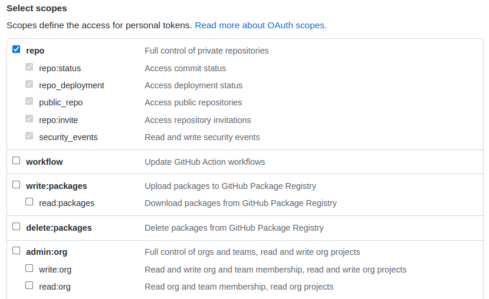

Guía para la redacción de tu manuscrito   Asignatura Biogeografía
(GEO-1310)
================
José Ramón Martínez Batlle

##  El “ecosistema” de servicios que usarás durante la asignatura

-   R+RStudio. Imprescindible. Dispondrás de una cuenta temporalmente en
    mi servidor para, a través del navegador, usar estos programas y los
    paquetes de R requeridos. No obstante, puedes prescindir de mi
    servidor si instalas R+RStudio en modo “Desktop”. Si te estás
    preguntando ¿Por qué R?, te recomiendo leer [este
    texto](https://github.com/geofis/curso-taller-analisis-biodiversidad-r-adebio-2021#por-qu%C3%A9-r).

-   Foro. Se trata de un servidor Mattermost, parecido a Slack, pero de
    código abierto. Envía tus preguntas por esa vía.

-   GitHub. Imprescindible. Necesitarás una cuenta de GitHub (quizá ya
    dispones de una) y un token para crear tu manuscrito y hacerle
    modificaciones. Más adelante te explico.

-   Vídeos tutoriales en YouTube y código fuente de ejemplo. Los vídeos
    tutoriales se encuentran alojados en la lista de reproducción
    [“Ecología numérica con
    R”](https://www.youtube.com/playlist?list=PLDcT2n8UzsCRDqjqSeqHI1wsiNOqpYmsJ).
    Estos vídeos se asocian con *scripts* de R que usarás como fuente
    para tus análisis (los adaptarás), y se encuentran en el repo
    [Scripts de análisis de
    BCI](https://github.com/biogeografia-master/scripts-de-analisis-BCI).
    No es necesario clonar dicho repo (más adelante explico en detalle),
    es preferible visualizarlo desde GitHub, tomar código, adaptarlo y
    ejecutarlo en tu repo propio de manuscrito, como verás en los vídeos
    tutoriales en cada caso (más detalles en clase).

## Prepara el “terreno” para tu manuscrito

### Realiza tutorial introductorio

Realiza el [tutorial “Introducción a
R”](https://geofis.shinyapps.io/tutorial1/). Se trata de una breve
introduccion interactiva y autoguiada en la que conocerás los
principales objetos de R. Además, este tutorial te muestra trucos sobre
cómo enfrentarte a la programación en R, por lo que **es muy importante
que lo realices y practiques**.

### Regístrate en GitHub y crea un token

Tal como te comenté, necesitarás una cuenta de GitHub. Para crearla, ve
a [github.com](https://github.com/), botón *Sign up* y sigue las
indicaciones correspondientes. Una vez tengas tu cuenta de GitHub,
podrás crear repositorios. Tu manuscrito se alojará en un repositorio de
GitHub, concretamente, en la organización creada al efecto para esta
asignatura, y esta es la razón por la que necesitas una cuenta en dicho
servicio. **No olvides notificarme tu usuario de GitHub tan pronto lo
tengas, para invitarte a la organización de la asignatura. Luego de que
te envíe la invitación, te llegará un mensaje de correo con una
invitación que debes aceptar para formar parte de la organización. Es
importante que completes el dicho proceso, porque de lo contrario, NO
podrás realizar las asignaciones.**

Tu cuenta de GH, por sí sola, no te permite hacer modificaciones de tu
manuscrito desde el “repo local” (que alojarás en el servidor de
RStudio) al repo remoto (en GitHub). Es decir, con usuario y password no
podrás empujar cambios al repo remoto (proceso que en terminología git
se conoce como *push*), para lo cual necesitarás un token. Créalo en
este momento, y resérvalo para uso posterior, siguiendo estos pasos
([también tienes esta guía
ilustrada)](https://docs.github.com/es/github/authenticating-to-github/keeping-your-account-and-data-secure/creating-a-personal-access-token).

1.  Inicia sesión con tu cuenta en [github.com](https://github.com/)

2.  Ve a *Settings* =&gt; *Developer Settings* =&gt; *Personal Access
    Token* =&gt; *Generate New Token* (probablemente pida tu clave de
    GitHub)

3.  Rellena el formulario.

    -   En *Note* escribe un nombre para el token. Por ejemplo,
        “Semestre 202201”

    -   En *Expiration* elige *Custom* y ponle una fecha posterior al
        término del semestre.

    -   Activa los permisos del grupo *repo*, tal como se muestra aquí:

    

4.  Finalmente presiona *Generate token*. Tu token será una cadena de
    caracteres parecida a esta: “*ghp\_Gsgxfd…*”

5.  **¡IMPORTANTE! Copia el token a un archivo de texto o a un mensaje
    de correo; GH no te lo mostrará nuevamente**.

### Crea tu repositorio remoto para el manuscrito en GitHub

1.  Asegúrate de haber iniciado en tu cuenta de GitHub. Si estás usando
    una PC compartida, y otro usuario tuviese una cuenta de GitHub
    iniciada, el manuscrito se creará con dicha cuenta. Por tal razón,
    asegúrate previamente de que sea tu cuenta de GH la que esté
    iniciada.

2.  También asegúrate de que eres parte de la organización de GitHub de
    la asignatura.

3.  Haz clic en la URL de la asignación (Classroom de GitHub):
    <https://classroom.github.com/a/dM_ub77N>

4.  Al hacer clic sobre la URL, te preguntará si aceptas la asignación
    del Classroom de GitHub. Presiona el botón *Accept this assignment*.

5.  Tras presionar el botón, se creará una copia remota vacía (un
    “esqueleto”) del repositorio de manuscrito, a partir de una
    plantilla, en la organización
    [biogeografia-202201](https://github.com/biogeografia-202201).
    Puedes consultarlo visitando la organización y presionando sobre el
    nombre de tu repo, que será algo tal que
    `unidad-0-asignacion-99-mi-manuscrito-TUNOMBREDEUSUARIOENGITHUB`.

### Crea una copia local de tu repo de manuscrito en mi servidor RStudio

Si ya tienes tu repo remoto de manuscrito, podrás hacer una copia local
en mi servidor RStudio; a este proceso se le denomina “clonar” en
terminología git. En dicha copia local alojarás tus ediciones que luego
sincronizarás con GitHub. Para clonar localmente tu repo, necesitarás el
token que creaste en pasos anteriores, así que tenlo a mano. Pasos para
crear tu copia local:

-   Sigue [este tutorial **HASTA el minuto
    5:10**](https://www.youtube.com/watch?v=v1EX8OzAyBw).

> Nota 1. En el minuto 3:42 verás que GitHub solicita clave. En ese paso
> necesitarás el token que recién creaste.

> Nota 2. Para acceder al servidor de RStudio, utiliza la URL, usuario y
> clave enviada a tu correo electrónico.

> Nota 3. Sigue las indicaciones que facilitaré en las sesiones de clase
> y en el foro de la asignatura, y pide ayuda siempre que la necesites.

### Vídeo BCI

Reproduce el vídeo introductorio sobre BCI titulado: [Un vistazo a la
ciencia y los científicos que trabajan en la isla de Barro Colorado
(versión en español)](https://www.youtube.com/watch?v=bN54RGtxFeM)

### Recapitulando

Antes de comenzar a redactar tu manuscrito, repasa la siguiente lista de
control:

1.  Tienes cuenta de GitHub y token. También verifica que formas parte
    de la organización de la asignatura, porque de lo contrario, no
    podrás realizar asignaciones.

2.  Creaste una copia remota del repositorio de manuscrito al aceptar la
    asignación del Classroom de GitHub.

3.  Creaste una copia local de tu repo de manuscrito en mi servidor
    RStudio. Para ello, verifica que dispones de credenciales acceso al
    servidor. Si no las tienes, escríbeme para resolverlo.

4.  Realizaste el
    [tutorial-introduccion-a-r](https://geofis.shinyapps.io/tutorial1/).

5.  Visualizaste el vídeo introductorio sobre BCI.

Si cumples con todo lo anterior, pasa al siguiente apartado. De lo
contrario, vuelve atrás y completa lo que te falte.

## Redacta tu manuscrito

### Familias de plantas asignadas

Tienes una familia de plantas asignada; localiza la tuya en la siguiente
lista así como el archivo `.Rdata` correspondiente:

| Estudiante                          | Nombre de la familia asignada | Nombre de archivo `.Rdata` (carpeta `biodata`) |
|-------------------------------------|-------------------------------|------------------------------------------------|
| Andri Jesus Binet Alvarez           | Fabaceae-caesalpinioideae     | Fabaceae-caesalpinioideae.Rdata                |
| Adalberto Martinez Ramos            | Salicaceae                    | Salicaceae.Rdata                               |
| Angel Luis Javier Hernandez         | Arecaceae                     | Arecaceae.Rdata                                |
| Catalino Valenzuela De Los Santos   | Lauraceae                     | Lauraceae.Rdata                                |
| Cinthia Amalia Vandepool Candelario | Malvaceae                     | Malvaceae.Rdata                                |
| Cleimi Mariali Montero Garabito     | Myrtaceae                     | Myrtaceae.Rdata                                |
| Cristina Altagracia Torres Gomez    | Urticaceae                    | Urticaceae.Rdata                               |
| Cruz Oscar Montero Mercado          | Myrsinaceae                   | Myrsinaceae.Rdata                              |
| Edel Tejeda Nova                    | Burseraceae                   | Burseraceae.Rdata                              |
| Elvin Ozuna                         | Moraceae                      | Moraceae.Rdata                                 |
| Ernesto Vladimir Santana Martinez   | Clusiaceae                    | Clusiaceae.Rdata                               |
| Gabriel Orlando Bido Feliz          | Chrysobalanaceae              | Chrysobalanaceae.Rdata                         |
| Gloribel Taveras Ramirez            | Sapotaceae                    | Sapotaceae.Rdata                               |
| Harly Manuel Suarez Cruz            | Annonaceae                    | Annonaceae.Rdata                               |
| Jang Correa                         | Fabaceae-papilionoideae       | Fabaceae-papilionoideae.Rdata                  |
| Jorge Eduardo Diaz Romero           | Apocynaceae                   | Apocynaceae.Rdata                              |
| Lewis Jose Cueto Montero            | Sapindaceae                   | Sapindaceae.Rdata                              |
| Miguel Landestoy Tejeda             | Piperaceae                    | Piperaceae.Rdata                               |
| Romanti Esther Aquino Payano        | Rubiaceae                     | Rubiaceae.Rdata                                |
| Ruseuny Peña Noboa                  | Fabaceae-mimosoideae          | Fabaceae-mimosoideae.Rdata                     |
| Saderis Carmona Marte               | Euphorbiaceae                 | Euphorbiaceae.Rdata                            |
| Yoel Agustín. Rodríguez Marte       | Meliaceae                     | Meliaceae.Rdata                                |
| Wilson Rosario R                    |                               |                                                |
| Yan Piero Bello De Lillo            |                               |                                                |

El archivo `.Rdata` de tu familia asignada contiene una matriz de
comunidad y datos censales. Necesitarás también la matriz ambiental, que
se encuentra en el archivo `matriz_ambiental.Rdata`. Dicha matriz es
común para todos, puesto que contiene las variables ambientales de todo
BCI. Todos los archivos `.Rdata` (matriz de comunidad+censo y matriz
ambiental), se encuentran en el servidor RStudio, dentro de tu repo de
manuscrito, en la carpeta `biodata`.

### Preguntas de investigación por áreas analíticas

En tu manuscrito, deberás responder un conjunto de preguntas de
investigación que se enmarcan en cuatro áreas analíticas de la ecología
numérica, con referencia a tu familia de plantas asignada de BCI. Dichas
áreas se relacionan a continuación: análisis de agrupamiento, análisis
diversidad, análisis de ordenación y ecología espacial. Dos cuestiones
relevantes a tener son:

1.  Las preguntas de investigación no se copian/pegan de este repo (ni
    de ningún otro sitio).

2.  Tus preguntas las deberás incluir de manera fluida en la sección
    “Introducción” de tu manuscrito.

Si no te resultare cómodo trabajar tu manuscrito usando preguntas de
investigación, puedes hacerlo por objetivo, que es una forma más
tradicional. No obstante, pienso que te resultará más cómodo investigar
por preguntas que por objetivos. Más adelante, en los tips de redacción,
te doy más detalles, pero por lo pronto, lee estas preguntas guía de las
áreas analíticas:

1.  Análisis de agrupamiento (*cluster analysis*, aa):

-   Los cuadros (o quadrats) de 1 hectárea, ¿se organizan en grupos
    discontinuos según la composición de las especies de mi familia
    seleccionada?
-   Si existe algún patrón, ¿es consistente con alguna variable
    ambiental/atributo?
-   ¿Hay especies indicadoras o con preferencia por determinadas
    condiciones ambientales/atributos?

2.  Técnicas de ordenación (*ordination analysis*, to):

-   En un espacio bidimensional, ¿existen tendencias apreciables de
    ordenación de las especies de mi familia seleccionada?
-   Si existen tendencias de ordenación, ¿se asocian éstas con variables
    ambientales/atributos?

3.  Diversidad (di):

-   Según los análisis de estimación de riqueza, ¿está suficientemente
    representada mi familia? Consideremos como buena representación un
    85%
-   ¿Existe asociación de la diversidad alpha con variables
    ambientales/atributos? ¿Con cuáles?
-   ¿Existe contribución local o por alguna especie a la diversidad
    beta?

4.  Ecología espacial (ee):

-   ¿Alguna(s) especies de mi familia presenta(n) patrón aglomerado?
    ¿Cuál(es)? ¿Se asocia con alguna variable?
-   ¿Predicen bien la ocurrencia de dicha(s) especie(s) los modelos de
    distribución de especies (SDM)?

Adicionalmente, usarás un conjunto de técnicas denominadas “análisis
exploratorio de datos” (aed) y “medición de asociación (ma)” que son
prescriptivas para realizar el manuscrito, y que verás en la lista de
reproducción de vídeos-tutoriales y en las clases prácticas. Dichas
técnicas no responden preguntas, más bien te ayudan a limpiar los datos
y a encontrar patrones preliminares que luego podrás aplicar a los
cuatro análisis temáticos.

### Recursos: repo scripts, vídeos y fuentes bibliográficas

Usarás una lista de vídeos tutoriales donde muestro cómo realizar los
análisis que usarás como insumos para tu manuscrito. Los vídeos se
apoyan fundamentalmente en scripts de R alojados en un repositorio de
GitHub.

#### Repositorio de scripts de análisis

Los *scripts* de R que usarás como fuente, se encuentran en el repo
[Scripts de análisis de
BCI](https://github.com/biogeografia-master/scripts-de-analisis-BCI).
Este dispone de un DOI que puedes usar para referirlo:

Igualmente, también para fines de referencia, dispones de una entrada
BibTeX del repo
[aquí](https://github.com/biogeografia-master/scripts-de-analisis-BCI#entrada-bibtex)

> Aviso. No es necesario clonar el repo de scripts. Es preferible
> visualizarlo desde GitHub, como verás en los vídeos tutoriales.

¿Por qué usarás datos de la parcela permanente de BCI? Para obtener
resultados empíricos consistentes, se necesitan datos de comunidad y
ambientales de calidad. El [conjunto de datos de
BCI](http://ctfs.si.edu/webatlas/datasets/bci) es idóneo en este
sentido, puesto que dispone de múltiples variables ambientales e
información de la comunidad basada en repetidos censos desde la década
de los 80 del siglo XX (Condit, 1998; Hubbel et al., 1999; Hubbel et
al., 2005). Los datos están bien documentados y contienen todas las
variables necesarias para cualquier análisis de ecología numérica.

#### Vídeos tutoriales

-   Sobre BCI

    -   [Vídeo 1: Datos censales parcela permanente 50 ha árboles BCI,
        explicado por el
        tali](https://www.youtube.com/watch?v=Hm6yO_V6NUY&list=PLDcT2n8UzsCRDqjqSeqHI1wsiNOqpYmsJ&index=1)

-   Sobre Herramientas Rmarkdown, GitHub

    -   [Vídeo 2. Cómo hacer *commit&gt;push* de cambios a un repo
        remoto desde un repo local en el servidor RStudio (DESDE el
        minuto 5:10)](https://www.youtube.com/watch?v=v1EX8OzAyBw). En
        párrafos anteriores te pedí que practicaras éste vídeo para
        clonar tu repo localmente en el servidor RStudio. Ahora te pido
        que continúes desde el minuto 5:10, para que hagas
        *commit&gt;push*, que es el proceso mediante el cual, tus
        cambios locales (en el servidor RStudio) se “sincronizan” con
        los del repo remoto (en GitHub). En el vídeo muestro cómo subir
        unos cambios sencillos (e hipotéticos) realizados al archivo
        `manuscrito.Rmd`.

    > El archivo `manuscrito.Rmd` es el que contendrá toda tu redacción,
    > y desde allí podrás generar tu salida en formato PDF.

    Los comandos a ejecutar, mencionados en el vídeo, son los siguientes
    (cambia por tu correo electrónico registrado en GitHub y tu usuario
    de GitHub):

        git config --global user.email "you@example.com"
        git config --global user.name "Your Name"

    En el minuto 11:54 verás que GitHub pide clave. En tu caso, deberás
    colocar el token que generaste en pasos anteriores.

    -   [Vídeo 3: Cómo introducir referencias bibliográficas citas APA
        usando Bibtex, insertar imágenes y tablas externas (no generadas
        por R en consola) en el manuscrito formato
        RMarkdown](https://www.youtube.com/watch?v=5PARNk6QTgY&list=PLDcT2n8UzsCRDqjqSeqHI1wsiNOqpYmsJ&index=3)

> En todos los vídeos tutoriales a continuación, verás que me refiero a
> scripts que disponen de dos versiones cada uno: una versión Markdown
> (archivo `.md`) y una versión R (archivo `.R`). Utiliza el archivo`.R`
> para copiar código, pegarlo en R y reproducir los análisis. Utiliza el
> archivo `.md` para ver el resultado “tejido” que obtendrías al
> ejecutar cada script.

-   Análisis exploratorio de datos (aed)

    -   [Vídeo 4: Crear script de análisis para generar objetos, tales
        como tablas de R y gráficos (por ejemplo, gráficos de mosaico,
        gráficos de dispersión), e insertarlos en documento de
        manuscrito formato RMarkdown (análisis exploratorio de datos).
        T39:19](https://www.youtube.com/watch?v=vRWoqzJrnk4&list=PLDcT2n8UzsCRDqjqSeqHI1wsiNOqpYmsJ&index=4)

    -   [Vídeo 5: Tutorial de `tidyverse`. Este vídeo tiene finalidad
        didáctica. Los análisis mostrados en éste son sólo
        demostrativos, y no tienen por qué terminar en tu manuscrito, a
        menos que así lo desees. En otros vídeos si ejecutaré análisis
        que podrían serte útiles en tu manuscrito, aplicando lo mostrado
        en este tutorial.
        T1:48:09](https://www.youtube.com/watch?v=YiUmteAbLt8&list=PLDcT2n8UzsCRDqjqSeqHI1wsiNOqpYmsJ&index=5)

    -   [Vídeo 6: Cómo crear mapas de riqueza y abundancia global y de
        mi familia de plantas asignada. En este vídeo, verás cómo crear
        mapas interactivos y estáticos de abundancia y riqueza, que
        podrás insertar en tu manuscrito.
        T35:31](https://www.youtube.com/watch?v=okMDGdgQ1EM&list=PLDcT2n8UzsCRDqjqSeqHI1wsiNOqpYmsJ&index=6)

    -   [Vídeo 7: Cómo crear mapas de variables ambientales.
        T27:37](https://www.youtube.com/watch?v=qe7qD03n0jI&list=PLDcT2n8UzsCRDqjqSeqHI1wsiNOqpYmsJ&index=7)

    -   [Vídeo 8: Cómo realizar análisis y paneles de correlación entre
        variables ambientales.
        T40:39](https://www.youtube.com/watch?v=xfKGOWNyJVc&list=PLDcT2n8UzsCRDqjqSeqHI1wsiNOqpYmsJ&index=8)

    -   [Vídeo 9: Mapas de variables ambientales **por lotes**.
        T15:33](https://www.youtube.com/watch?v=SNYhP5mqlTQ&list=PLDcT2n8UzsCRDqjqSeqHI1wsiNOqpYmsJ&index=9)

-   Medición de asociación (ma)

    -   [Vídeo 10: Modos de análisis Q y R. Paradoja de Orlóci.
        T29:12](https://www.youtube.com/watch?v=yQ10lp0-nHc&list=PLDcT2n8UzsCRDqjqSeqHI1wsiNOqpYmsJ&index=10)

    -   [Vídeo 11: Modo de análisis Q, para comparar asociación entre
        objetos (sitios) usando métricas de distancia.
        T36:11](https://www.youtube.com/watch?v=M3GfFzkJFys&list=PLDcT2n8UzsCRDqjqSeqHI1wsiNOqpYmsJ&index=11)

    -   [Vídeo 12: Modo de análisis R, para comparar dependencia entre
        descriptores (variables) usando tanto métricas de distancia como
        de correlación.
        T28:16](https://www.youtube.com/watch?v=mef9NIjXBWY&list=PLDcT2n8UzsCRDqjqSeqHI1wsiNOqpYmsJ&index=12)

-   Análisis de agrupamiento (*cluster analysis*, aa)

    -   [Vídeo 13: agrupamiento jerárquico.
        T38:14](https://www.youtube.com/watch?v=AW5L-uZlEvk&list=PLDcT2n8UzsCRDqjqSeqHI1wsiNOqpYmsJ&index=13)

    -   [Vídeo 14: Interpretación y comparación de resultados.
        T1:11:54](https://www.youtube.com/watch?v=y1ZZh9ajT_U&list=PLDcT2n8UzsCRDqjqSeqHI1wsiNOqpYmsJ&index=14)

    -   [Vídeo 15: Grupos (clústers), variables ambientales y mapas.
        T33:49](https://www.youtube.com/watch?v=ZrXpgDAaDo8&list=PLDcT2n8UzsCRDqjqSeqHI1wsiNOqpYmsJ&index=15)

    -   [Vídeo 16: Especies indicadoras, especies con preferencia por
        hábitats.
        T55:05](https://www.youtube.com/watch?v=JK7hq71onKs&list=PLDcT2n8UzsCRDqjqSeqHI1wsiNOqpYmsJ&index=16)

-   Análisis de diversidad alpha y beta (di)

    -   [Vídeo 17: Diversidad alpha.
        T1:45:15](https://www.youtube.com/watch?v=QVfVH2bVJbM&list=PLDcT2n8UzsCRDqjqSeqHI1wsiNOqpYmsJ&index=19)

    -   [Vídeo 18: Diversidad beta.
        T23:29](https://www.youtube.com/watch?v=rJ67sF0hYuE&list=PLDcT2n8UzsCRDqjqSeqHI1wsiNOqpYmsJ&index=20)

-   Análisis de ordenación simple (no restringida) y canónica
    (restringida) (to)

    -   [Vídeo 19: Ordenación no restringida. PCA, CA y PCoA.
        T2:08:05](https://www.youtube.com/watch?v=xLFz4WRgoDE&list=PLDcT2n8UzsCRDqjqSeqHI1wsiNOqpYmsJ&index=17)

    -   [Vídeo 20: Ordenación restringida o ‘canónica’. RDA, CCA.
        T1:11:44](https://www.youtube.com/watch?v=bKyBGxNotgM&list=PLDcT2n8UzsCRDqjqSeqHI1wsiNOqpYmsJ&index=18)

-   Ecología espacial (ee)

    -   [Vídeo 21: Análisis espacial de datos ecológicos.
        Autocorrelación.
        T1:09:52](https://www.youtube.com/watch?v=vS4Xm0PRxPM&list=PLDcT2n8UzsCRDqjqSeqHI1wsiNOqpYmsJ&index=21)

#### Algunas fuentes bibliográficas sugeridas (lista “mínima”)

##### Sobre BCI (referencias útiles tanto para la introducción como para la metodología y la discusión)

La lista de artículos sobre BCI es enorme, pero te incluyo varios
relevantes (amplía tus horizontes, no te quedes con esta corta lista):

-   Citas obligatorias y, por lo tanto, tienes que leerlas diagonalmente
    (hay un libro entre ellas, que lógicamente no tienes que leer
    íntegramente, pero debes saber de qué va):

    -   [Hubbell, S.P., Condit, R., and Foster, R.B. 2005. Barro
        Colorado Forest Census Plot Data. URL
        http://ctfs.si.edu/webatlas/datasets/bci](http://ctfs.si.edu/webatlas/datasets/bci/).
        Esta es la página de entrada al censo de BCI 50-ha plot, por lo
        que es imprescindible citarla.

    -   [Condit, R. 1998. Tropical Forest Census Plots. Springer-Verlag
        and R. G. Landes Company, Berlin, Germany, and Georgetown,
        Texas.](https://drive.google.com/file/d/1sSJv_seBgyYGZJlBRJw2OxLcCG5Pa1iU/view?usp=sharing)

    -   [Hubbell, S.P., R.B. Foster, S.T. O’Brien, K.E. Harms, R.
        Condit, B. Wechsler, S.J. Wright, and S. Loo de Lao. 1999. Light
        gap disturbances, recruitment limitation, and tree diversity in
        a neotropical forest. Science 283:
        554-557.](http://faculty.washington.edu/timbillo/Readings%20and%20documents/forest%20plot%20tree%20dynamics/Hubbell%20et%20al.%201999%20Science%20light%20gap%20disturbances.pdf)

-   [Beta-Diversity in Tropical Forest
    Trees](https://repository.si.edu/bitstream/handle/10088/1599/Condit_et_al.pdf?sequence=1&isAllowed=y)

-   [Condit, R., Ashton, P. S., Manokaran, N., LaFrankie, J. V.,
    Hubbell, S. P., & Foster, R. B. (1999). Dynamics of the forest
    communities at Pasoh and Barro Colorado: comparing two 50–ha plots.
    Philosophical Transactions of the Royal Society of London. Series B:
    Biological Sciences, 354(1391),
    1739-1748.](https://www.ncbi.nlm.nih.gov/pmc/articles/PMC1692684/pdf/11605618.pdf)

-   [Condit, R., Hubbell, S. P., Lafrankie, J. V., Sukumar, R.,
    Manokaran, N., Foster, R. B., & Ashton, P. S. (1996). Species-area
    and species-individual relationships for tropical trees: a
    comparison of three 50-ha plots. Journal of Ecology,
    549-562.](https://repository.si.edu/bitstream/handle/10088/19462/stri_1996_Species_area_and_species_individual_and_Condit_Richard_S.pdf)

-   [Harms, K. E., Condit, R., Hubbell, S. P., & Foster, R. B. (2001).
    Habitat associations of trees and shrubs in a 50‐ha neotropical
    forest plot. Journal of Ecology, 89(6),
    947-959.](https://besjournals.onlinelibrary.wiley.com/doi/pdf/10.1111/j.1365-2745.2001.00615.x)

-   [Meyer, V., Saatchi, S. S., Chave, J., Dalling, J. W., Bohlman, S.,
    Fricker, G. A., … & Hubbell, S. (2013). Detecting tropical forest
    biomass dynamics from repeated airborne lidar measurements.
    Biogeosciences,
    10(8), 5421.](https://pdfs.semanticscholar.org/2132/00ddbc2bfbd2ba6416d5716133c794ccddf8.pdf)

-   [Horvát, S., Derzsi, A., Néda, Z., & Balog, A. (2010). A spatially
    explicit model for tropical tree diversity patterns. Journal of
    theoretical biology, 265(4),
    517-523.](https://arxiv.org/pdf/0803.3704.pdf)

##### Sobre ecología/biogeografía y, específicamente, ecología de plantas (referencias útiles para la introducción y la discusión)

Esta también es una selección mínima; sé libre, complementa.

-   [Lomolino, M. V., Riddle, B. R., Whittaker, R. J., & Brown, J. H.
    (2010). Biogeography (Sinauer, Sunderland,
    MA).](https://drive.google.com/file/d/1N-7bilXO3g3KKRXWIyEr8cx6lkT2xBXY/view?usp=sharing)

-   [Smith, T., & Smith, R. (2007). Ecología (6
    edición).](https://drive.google.com/file/d/1vfgNkj0D3cVYhnYldtUaY4ldnFGa4x47/view?usp=sharing)

-   [Van der Valk, A. G. (2009). Forest Ecology. Recent Advances in
    Plant
    Ecology, 358.](https://drive.google.com/file/d/1-xRUcQ7XeRMnrb6EOhnPBHLRVbpg_zSB/view?usp=sharing)

-   [Lange, O. L., Nobel, P. S., Osmond, C. B., & Ziegler, H. (2013).
    Physiological plant ecology III: Responses to the chemical and
    biological environment (Vol. 12). Springer Science & Business
    Media.](https://drive.google.com/file/d/17tUTjyINYWZm7VjIZUg2jkifqlfS4R7F/view?usp=sharing)

-   [Grandtner, M. M., & Chevrette, J. (2013). Dictionary of trees,
    volume 2: South America: Nomenclature, taxonomy and ecology.
    Academic
    Press](https://drive.google.com/file/d/13eGdtY_1dwn6kitx6lCmZC5UVISqLYPA/view?usp=sharing).
    **Este diccionario podría ser útil para encontrar géneros
    específicos de plantas y posibles patrones de preferencia con
    variables ambientales.**

-   Dos notas sobre referencias para la introducción:

    -   Tu familia de plantas y las variables ambientales que resulten
        finalmente asociadas, son aspectos que aplican específicamente a
        tu caso. Por lo tanto, tu bibliografía contendrá referencias que
        no se encuentran citadas en este mensaje.

    -   Hipotéticamente, iniciaste este estudio “luego de haber
        explorado patrones y haber descubierto, de manera preliminar,
        que había algún grado de asociación entre la comunidad y su
        medio”. Ya sabemos que no fue así, puesto que se trata de un
        requisito a cumplir en la asignatura, pero normalmente los
        estudios parten de un problema o de pregunta de investigación.

##### Sobre ecología numérica (referencias útiles para la metodología)

-   [Borcard, D., Gillet, F., & Legendre, P. (2018). Numerical ecology
    with R.
    Springer.](https://drive.google.com/file/d/1BqNqYHt9xs9-_7ObJTpJm6Iop3EQeESl/view?usp=sharing)

-   [Krebs, C. J. (1989). Ecological methodology (No. QH541. 15. S72.
    K74 1999.). New York: Harper &
    Row.](https://drive.google.com/file/d/11ivkaFkzzE_XFoN_o5wU4YBfMeA0UBqc/view?usp=sharing)

-   [Magurran, A. E. (2013). Measuring biological diversity. John Wiley
    &
    Sons.](http://www2.ib.unicamp.br/profs/thomas/NE002_2011/maio10/Magurran%202004%20c2-4.pdf)

-   [Koleff, P., Gaston, K. J., & Lennon, J. J. (2003). Measuring beta
    diversity for presence–absence data. Journal of Animal Ecology,
    72(3),
    367-382.](https://besjournals.onlinelibrary.wiley.com/doi/pdf/10.1046/j.1365-2656.2003.00710.x%4010.1111/%28ISSN%291365-2745.BIODIV)

##### Sobre R (referencias útiles para la metodología)

No se puede olvidar R. Dejo aquí la entrada bibtex sobre dicho recurso,
la cual debes colocar en el archivo .bib. Esta entrada no es un material
a consultar (los que están más adelante sí), es sólo una referencia
modelo para citar a R:

    @Manual{,
        title = {R: A Language and Environment for Statistical Computing},
        author = {{R Core Team}},
        organization = {R Foundation for Statistical Computing},
        address = {Vienna, Austria},
        year = {2020},
        url = {https://www.R-project.org/},
      }

No olvides los paquetes que más usarás (aprovecha las referencias para
leer sobre ellos):

-   [Oksanen, J. (2013). Vegan: ecological diversity. R
    Project.](http://mirror.linux.duke.edu/cran/web/packages/vegan/vignettes/diversity-vegan.pdf)

-   [Multivariate Analysis of Ecological Communities in
    R](http://ubio.bioinfo.cnio.es/Cursos/CEU_MDA07_practicals/Further%20reading/Oksanen%202005/R-%20Vegan%20tutorial%20-%20Multivariate%20analysis%20of%20ecological%20communities%20by%20Oksanen.pdf)

-   La entrada bibtex de `vegan` es ésta:

<!-- -->

    @Manual{,
        title = {vegan: Community Ecology Package},
        author = {Jari Oksanen and F. Guillaume Blanchet and Michael Friendly and Roeland Kindt and Pierre Legendre and Dan McGlinn and Peter R. Minchin and R. B. O'Hara and Gavin L. Simpson and Peter Solymos and M. Henry H. Stevens and Eduard Szoecs and Helene Wagner},
        year = {2019},
        note = {R package version 2.5-6},
        url = {https://CRAN.R-project.org/package=vegan},
      }

-   [El paquete `BiodiversityR` también lo
    usarás](http://apps.worldagroforestry.org/downloads/Publications/PDFS/b13695.pdf).
    Entada bibtex:

<!-- -->

    @Book{,
        title = {Tree diversity analysis. A manual and software for common statistical methods for ecological and biodiversity studies},
        author = {R. Kindt and R. Coe},
        publisher = {World Agroforestry Centre (ICRAF)},
        address = {Nairobi (Kenya)},
        year = {2005},
        note = {ISBN 92-9059-179-X},
        url = {http://www.worldagroforestry.org/output/tree-diversity-analysis},
      }

-   La colección `tidyverse`, no puedes olvidarla. Dejo la entrada
    bibtex abajo:

<!-- -->

    @Manual{,
        title = {tidyverse: Easily Install and Load the 'Tidyverse'},
        author = {Hadley Wickham},
        year = {2017},
        note = {R package version 1.2.1},
        url = {https://CRAN.R-project.org/package=tidyverse},
      }

-   Paquete `indicspecies`

<!-- -->

      @Manual{,
        title = {Associations between species and groups of sites: indices and statistical inference},
        author = {Miquel {De Caceres} and Pierre Legendre},
        journal = {Ecology},
        year = {2009},
        url = {http://sites.google.com/site/miqueldecaceres/},
      }

##### Entrada BibTex para referir el repo Scripts de análisis de BCI

    @software{jose_ramon_martinez_batlle_2020_4402362,
      author       = {José Ramón Martínez Batlle},
      title        = {{biogeografia-master/scripts-de-analisis-BCI: Long 
                       coding sessions}},
      month        = dec,
      year         = 2020,
      publisher    = {Zenodo},
      version      = {v0.0.0.9000},
      doi          = {10.5281/zenodo.4402362},
      url          = {https://doi.org/10.5281/zenodo.4402362}
    }

### Calendario de entregas

| Ítem                                | ¿Qué entregas?                                                                                                                                                                | 15/feb/2022                                         | 22/feb/2022                                                                                                                                                                                                                                                                                                                                                                                                                                                                                                       | 8/mar/2022                                                                                                                                                                                                                                                                                                                                                                                                     | 22/mar/2022                                                                                                                                                                                                                                                                                                                                                                                                                                                                                                                                                                                                                                                                                                                        | 5/abr/2022                                                                                                                                                                                                     | 19/abr/2022                                                                                                                                                                                                                                                                                                        | 3/may/2022                                              | 3/may/2022-17/may/2022                      | 24/may/2022                                                        |
|-------------------------------------|-------------------------------------------------------------------------------------------------------------------------------------------------------------------------------|-----------------------------------------------------|-------------------------------------------------------------------------------------------------------------------------------------------------------------------------------------------------------------------------------------------------------------------------------------------------------------------------------------------------------------------------------------------------------------------------------------------------------------------------------------------------------------------|----------------------------------------------------------------------------------------------------------------------------------------------------------------------------------------------------------------------------------------------------------------------------------------------------------------------------------------------------------------------------------------------------------------|------------------------------------------------------------------------------------------------------------------------------------------------------------------------------------------------------------------------------------------------------------------------------------------------------------------------------------------------------------------------------------------------------------------------------------------------------------------------------------------------------------------------------------------------------------------------------------------------------------------------------------------------------------------------------------------------------------------------------------|----------------------------------------------------------------------------------------------------------------------------------------------------------------------------------------------------------------|--------------------------------------------------------------------------------------------------------------------------------------------------------------------------------------------------------------------------------------------------------------------------------------------------------------------|---------------------------------------------------------|---------------------------------------------|--------------------------------------------------------------------|
| Manuscrito                          | **Secciones de tu manuscrito**, incorporando análisis realizados con lo que aprendas en los tutoriales y en sesiones de seguimiento                                           |                                                     | Editado encabezado YAML, excepto abstract. Iniciada la introducción                                                                                                                                                                                                                                                                                                                                                                                                                                               | Sección Introducción completada                                                                                                                                                                                                                                                                                                                                                                                | Sección Metodología completada                                                                                                                                                                                                                                                                                                                                                                                                                                                                                                                                                                                                                                                                                                     | Avances sobre sección Resultados                                                                                                                                                                               | Sección Resultados completada                                                                                                                                                                                                                                                                                      | Discusión y resumen completados. Manuscrito finalizado. | Recibes mi retroalimentación sobre tu texto | Atendido cada punto señalado por mí. Presentación de diapositivas. |
| Tutoriales visualizados y adaptados | 1\) **Pruebas** de que comprendes los tutoriales y/o 2) **Scripts de R** (archivos .R) aplicados a tu familia; 3) Tu **manuscrito** refleja lo aprendido en dichos tutoriales | [tutorial1](https://geofis.shinyapps.io/tutorial1/) | Vídeos [1](https://www.youtube.com/watch?v=Hm6yO_V6NUY&list=PLDcT2n8UzsCRDqjqSeqHI1wsiNOqpYmsJ&index=1) y [2](https://www.youtube.com/watch?v=v1EX8OzAyBw&list=PLDcT2n8UzsCRDqjqSeqHI1wsiNOqpYmsJ&index=2), [3](https://www.youtube.com/watch?v=5PARNk6QTgY&list=PLDcT2n8UzsCRDqjqSeqHI1wsiNOqpYmsJ&index=3), [4](https://www.youtube.com/watch?v=vRWoqzJrnk4&list=PLDcT2n8UzsCRDqjqSeqHI1wsiNOqpYmsJ&index=4) y [5](https://www.youtube.com/watch?v=YiUmteAbLt8&list=PLDcT2n8UzsCRDqjqSeqHI1wsiNOqpYmsJ&index=5) | Vídeos [6](https://www.youtube.com/watch?v=okMDGdgQ1EM&list=PLDcT2n8UzsCRDqjqSeqHI1wsiNOqpYmsJ&index=6), [7](https://www.youtube.com/watch?v=qe7qD03n0jI&list=PLDcT2n8UzsCRDqjqSeqHI1wsiNOqpYmsJ&index=7), [8](https://www.youtube.com/watch?v=xfKGOWNyJVc&list=PLDcT2n8UzsCRDqjqSeqHI1wsiNOqpYmsJ&index=8) y [9](https://www.youtube.com/watch?v=SNYhP5mqlTQ&list=PLDcT2n8UzsCRDqjqSeqHI1wsiNOqpYmsJ&index=9) | Vídeos [10](https://www.youtube.com/watch?v=yQ10lp0-nHc&list=PLDcT2n8UzsCRDqjqSeqHI1wsiNOqpYmsJ&index=10), [11](https://www.youtube.com/watch?v=M3GfFzkJFys&list=PLDcT2n8UzsCRDqjqSeqHI1wsiNOqpYmsJ&index=11), [12](https://www.youtube.com/watch?v=mef9NIjXBWY&list=PLDcT2n8UzsCRDqjqSeqHI1wsiNOqpYmsJ&index=12), [13](https://www.youtube.com/watch?v=AW5L-uZlEvk&list=PLDcT2n8UzsCRDqjqSeqHI1wsiNOqpYmsJ&index=13), [14](https://www.youtube.com/watch?v=y1ZZh9ajT_U&list=PLDcT2n8UzsCRDqjqSeqHI1wsiNOqpYmsJ&index=14), [15](https://www.youtube.com/watch?v=ZrXpgDAaDo8&list=PLDcT2n8UzsCRDqjqSeqHI1wsiNOqpYmsJ&index=15) y [16](https://www.youtube.com/watch?v=JK7hq71onKs&list=PLDcT2n8UzsCRDqjqSeqHI1wsiNOqpYmsJ&index=16) | Vídeos [17](https://www.youtube.com/watch?v=QVfVH2bVJbM&list=PLDcT2n8UzsCRDqjqSeqHI1wsiNOqpYmsJ&index=19) y [18](https://www.youtube.com/watch?v=rJ67sF0hYuE&list=PLDcT2n8UzsCRDqjqSeqHI1wsiNOqpYmsJ&index=20) | Vídeos [19](https://www.youtube.com/watch?v=xLFz4WRgoDE&list=PLDcT2n8UzsCRDqjqSeqHI1wsiNOqpYmsJ&index=17), [20](https://www.youtube.com/watch?v=bKyBGxNotgM&list=PLDcT2n8UzsCRDqjqSeqHI1wsiNOqpYmsJ&index=18) y [21](https://www.youtube.com/watch?v=vS4Xm0PRxPM&list=PLDcT2n8UzsCRDqjqSeqHI1wsiNOqpYmsJ&index=21) |                                                         |                                             |                                                                    |

### Tips de redacción

Por experiencia, sé que de nada valdría impartir un curso sobre cómo
escribir un manuscrito. A escribir se aprende escribiendo (redunda sí,
pero es así). Por ello, en este mensaje verás cuestiones básicas, pero
también aportaré referencias complementarias con las que podrás
profundizar.

En tu manuscrito, deberás responder las preguntas de investigación sobre
ecología numérica. No se trata de un examen en el que rellenas
“preguntas de desarrollo”; se trata de escribir un manuscrito con todas
las secciones que tiene el “esqueleto” facilitado por mí (e.g. Resumen,
Introducción, Metodología, Resultados, Discusión, etc.), siguiendo las
[normas del Anuario de Investigaciones Científicas de la
UASD](docs/instrucciones-para-autores-anuario-investigaciones-cientificas-UASD.pdf).
Cuentas con la plantilla del manuscrito—y que se encuentra en tu repo de
manuscrito—que satisface bastante bien los requisitos del Anuario, así
que al menos en cuanto a la forma no tendrás que preocuparte mucho.

Como norma general, **nunca copies y pegues texto, puesto que es plagio
y lo penalizo con la reprobación de la asignatura. Si necesitas citar a
un/a autor/a, usa tus propias palabras, pero nunca transcribas texto
hacia tu manuscrito** (hay contadas excepciones a esta regla, pero
ninguna aplica en tu caso).

Recuerda que, para cada pregunta de investigación, te servirá redactar
una hipótesis de partida. Considera una hipótesis como una posible
respuesta a cada pregunta. No te esfuerces en formular “la hipótesis
correcta”; formula una posible respuesta a cada pregunta de acuerdo a lo
que entiendas lógico.

Sobre el contenido que normalmente se desarrolla en las secciones un
manuscrito común, te doy un vistazo general. La **introducción**
responde a ¿Por qué haces el estudio en cuestión? ¿Por qué es importante
o por qué elegiste un método específico? ¿qué vacío rellena el estudio?
Por otra parte, la **metodología** describe el cómo, ofreciendo tantos
detalles como te sea posible, sin desarrollar métodos que han creado
otros y que ya están debidamente explicados en sus respectivas fuentes;
redactas y resumes con tus palabras, remitiendo a las referencias
convenientemente. En los **resultados** expones el qué, el lugar donde
muestras lo que encontraste luego de colectar y analizar, con tus
métodos, los datos fuente. Finalmente, en la **discusión** respondes a
la pregunta ¿Y ahora qué?; es decir, aclaras si respondiste tus
preguntas, qué vacío llenaste y qué nuevas preguntas de investigación
(o, más amplio, problemas) surgieron a partir de tu trabajo. Explico más
detalles sobre qué contienen las secciones de un manuscrito en los
apartados siguientes.

#### Sobre la introducción

La introducción equivale a ¿Por qué? No sueles justificar una acción, un
deseo o un estudio con una simple oración. Das contexto y, cuando ya has
planteado la imagen global del tema en cuestión (e.g. avances realizados
hasta ahora, vacíos existentes), entonces haces el planteamiento del
problema. Normalmente, un problema por resolver es algo muy global
(piensa en él como el tradicional objetivo general), por lo que te
enfocas en preguntas de investigación específicas (piensa en éstas como
los tradicionales objetivos específicos).

Por el mismo razonamiento anterior, normalmente verás que en tutoriales
sobre redacción, se recomienda que el último párrafo de la introducción
formules tus preguntas de investigación o tus objetivos; si te es
posible, también formula hipótesis para cada pregunta. Considera una
hipótesis como una posible respuesta a cada pregunta, pero no te
esfuerces en formular “la hipótesis correcta”; formula una posible
respuesta a cada pregunta de acuerdo a lo que entiendas lógico.

Finalmente, algunas referencias. Esto es lo mejor que conozco sobre
[pautas para elaborar una introducción en
español](http://www.scielo.org.co/scielo.php?script=sci_arttext&pid=S0120-53072008000100001).
Sin embargo, las pautas que más me gustan [están en
inglés](https://www.editage.com/insights/4-step-approach-to-writing-the-introduction-section-of-a-research-paper).
Puedes usar el traductor [DeepL](https://www.deepl.com/translator),
porque produce frases más naturales.

#### Sobre la discusión

En la discusión, el tiempo presente es el más usado, pero hay
excepciones. Si se interpretan resultados, que es lo que más espacio
ocupa en una discusión, se usa tiempo presente. Sin embargo, cuando se
resumen los hallazgos (esto también se hace de manera muy suscinta en la
discusión), se usa el tiempo pasado, aunque el presente es igualmente
válido. Si se describen nuevas ideas de investigación o problemas que
quedan pendientes de resolver, normalmente se usa el tiempo futuro.

La discusión normalmente responde a la pregunta “Con todo esto que hice,
¿ahora qué?”. Existe una tradición de dividir la discusión en las
siguientes partes (normalmente, cada una es un párrafo, pero varía):
entrada (hallazgos y su relación con trabajos previos),
interpretación/implicaciones (¿por qué?), futuro (el cual a veces se
subdivide en muchas pequeñas partes) y limitaciones.

-   Entrada

Debe incorporar resumen de ámbito general, es decir, un extracto sobre
la novedad para el conjunto de las ciencias el/los hallazgos
realizado/s, así como contrastes o continuación/extensión de hallazgos
previos, ya sean éstos realizados por ti o por otros autores (citas
requeridas). En otras palabras, debes expresar, de manera global, qué
parte de las preguntas planteadas respondiste en tu estudio. No se trata
de escribir “respondí a las preguntas”, sino más bien de señalar los
hallazgos de manera suscinta.

En el contexto de un trabajo sobre ecología numérica como el que estás
realizando, donde (con suerte) tienes preguntas formuladas y
probablemente hipótesis, esta entrada debe reseñar (sin entrar en el
detalle) qué cosas respondiste y/o si se confirmaron o no tus hipótesis.

Un ejemplo: asume que no tienes hipótesis, sólo tienes preguntas, este
párrafo suele comenzar tal que esto:

“Las especies A y B (Fabaceae-Papilionoideae) presentaron asociación con
las variables edáficas H e I…. Este resultado amplia conocimiento previo
… sobre … (cita)”

Otra alternativa:

“Los resultados mostraron que las especies A y B
(Fabaceae-Papilionoideae) presentan asociación con variables edáficas…”.

(no olvides que esta parte también se puede escribir en tiempo presente,
pero habitualmente se usa el pasado)

Ahora asume que tienes hipótesis, entonces, la entrada suele comenzar
con:

“Se confirma / No se confirma …”

-   Interpretación/implicaciones

Aquí escribes cómo explicas lo encontrado y, si cabe, qué implicaciones
tiene. Resumirás “por qué” ocurre lo que ocurre. Debes describir cómo,
según tú y en tono sugerente, explicarías el resultado obtenido. Para
esta tarea, necesitarás referencias adicionales, o quizá algunas de las
que hayas incluido en la introducción. Igualmente, dado que entrarás en
el campo de la libre interpretación, puedes incluir las implicaciones
(en términos de importancia) que tienen los hallazgos sobre el conjunto
de la ciencia.

Ejemplo:

“El hallazgo de esta asociación sugiere que las especies A y B están
asociadas a procesos geoquímicos tales como … . Esto implica que, en
determinadas condiciones de micro-hábitat, …”

(se redacta en presente y quizá alguna parte en futuro)

-   Futuro

Cualquier hallazgo abre nuevas vías de estudio, ya sea porque se
necesite confirmación adicional, o porque oriente nuevas líneas de
investigación. Los elementos de “futuro” que suelen incluirse son: cómo
el hallazgo podría promover nueva investigación a futuro y la
importancia del hallazgo para resolver problemas viejos.

(lógicamente, se redacta en futuro)

-   Limitaciones

Sólo si cabe, incluir un párrafo (o los que correspondan) sobre las
posibles limitaciones del hallazgo, es decir, cuál es su alcance real
aterrizando las expectativas. Igualmente, se puede añadir qué
limitaciones existen actualmente para continuar profundizando en esta
línea de investigación.

## URLs de referencia

-   [Esta guía](guia-redaccion-manuscrito.md).

-   [Organización de GitHub “biogeografia-202201” (repos de estudiantes
    del semestre actual)](https://github.com/biogeografia-202201/)

-   [Programa de la
    asignatura](https://github.com/biogeografia-202201/material-de-apoyo/blob/master/programa-biogeografia-geo1310.md).

-   [Tutorial “Introducción a
    R”](https://geofis.shinyapps.io/tutorial1/).

-   [Drive de Google conteniendo referencias bibliográficas y otras
    fuentes/recursos](https://drive.google.com/drive/u/1/folders/1cnEPpPjNpFyB-nrfkTxMv0qgyvTH4o28)

-   [Drive de Google conteniendo
    vídeos](https://drive.google.com/drive/folders/1wFq_6NwLtJOS-a-9aZlu8n45_2gJlHqv?usp=sharing)

-   [Canal de YouTube del
    profesor](https://www.youtube.com/user/pelempito1)

-   [Lista de reproducción **Ecología numérica con
    R**](https://www.youtube.com/watch?v=v1EX8OzAyBw&list=PLDcT2n8UzsCRDqjqSeqHI1wsiNOqpYmsJ)
