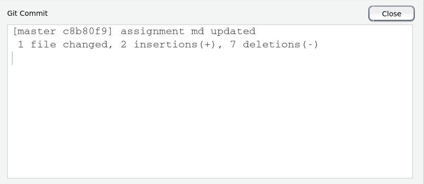
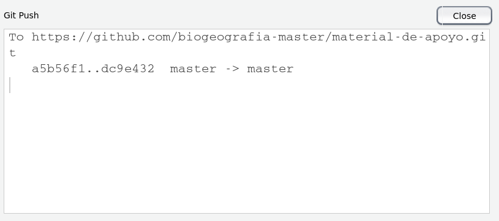
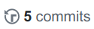
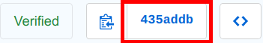
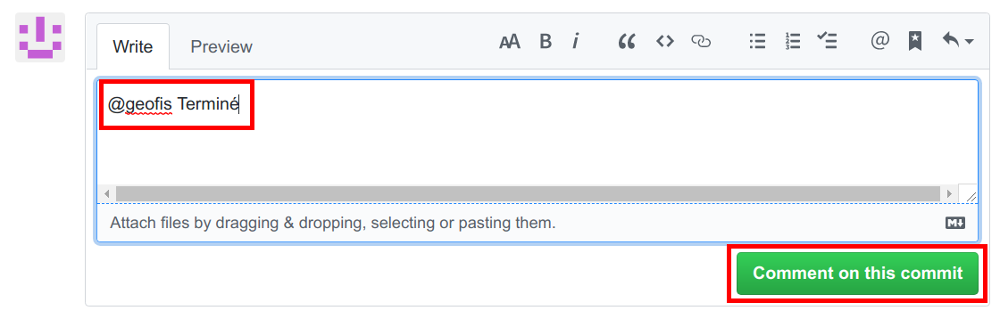
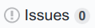

# ¿Cómo realizar una asignación?

En este documento te explico cómo crear un propio repositorio con tu asignación, cómo realizarla, cómo notificarme al terminarla y cómo crear un *issue* o incidencia para pedir ayuda.

## Crea un repositorio con tu asignación

1. Desde el navegador, entra en [Github](https://github.com/) e [inicia sesión](https://github.com/login) con tu cuenta. Si usas una PC pública o compartida, es preferible que inicies el navegador en modo incógnito. Si no tienes cuenta de Github, [crea una](https://github.com/join). Ésta será la cuenta que usarás durante el curso.

2. Ve a tu buzón de correo y, en el mensaje enviado por el profesor (podría caer en spam), haz clic en el vínculo (será algo tal que https<i></i>://classroom.github.com/...).

3. Al hacer clic, el navegador te dirigirá a aceptar la asignación (te pedirá que inicies tu cuenta de Github si aún no lo has hecho). Presiona `Accept this assignment`. Cuando quieras volver a tu asignación, puedes usar este vínculo del mensaje de invitación.

4. Automáticamente se creará, en una "organización" de GitHub que se corresponde con la asignatura y el semestre actual ([biogeografia-201902](https://github.com/biogeografia-201902), administrada por el profesor y de la cual formas parte), un repo conteniendo tu asignación. Listo, tienes ya un repo con tu asignación, donde realizarás tus actualizaciones. Tú y el profesor serán los únicos contribuidores del repo.

* Nota: estos 4 pasos se ejecutan una sola vez

## Realiza tu asignación

Elige una de dos alternativas en función del tipo de asignación:

### Usando la interfaz web de GitHub

Usa la interfaz web de GitHub si no necesitas ejecutar código. Por ejemplo, usa esta alternativa si vas a hacer un documento de texto en Markdown que contenga tus preguntas de investigación ([tutorial sobre Markdown](https://www.youtube.com/watch?v=y6XdzBNC0_0), [buen blog en inglés sobre Markdown](https://girlknowstech.com/how-to-write-in-markdown/), [este otro con vídeos cortos y concisos](https://instructor-support.datacamp.com/en/articles/2336337-markdown-tutorial) y [buen tutorial en inglés sobre redacción académica](https://www.youtube.com/watch?v=hpAJMSS8pvs)). El interfaz web de GitHub es bastante sencillo. Sigue estos pasos:

1. Inicia una sesión en GitHub con tu usuario/contraseña.

2. Localiza el repo que contiene la asignación, donde podrás hacer cambios a un archivo existente o crear uno nuevo (dependerá de lo asignado):

    1. Para actualizar un archivo existente, haz clic sobre su nombre y luego en el lápiz del encabezado. Haz los cambios que correspondan según lo asignado.
    
    2. Para crear un nuevo documento, presiona el botón `Create new file`, se creará un documento en blanco, ponle un nombre en la caja `Name your file` y, en el documento, añade el texto que corresponda según lo asignado.
    
3. Al terminar de añadir texto/hacer cambios, ve al final de la página y presiona `Commit changes`.

Hasta aquí cómo usar la interfaz web de GitHub para realizar tus asignaciones. Recuerda, esta modalidad es útil si no necesitas ejecutar código, para redactar documentos de Markdown o para pequeñas ediciones de código. Más detalles, en el aula.

### Usando RStudio

Utiliza RStudio como editor o cuaderno (*notebook*) si vas a ejecutar código de R, como por ejemplo crear objetos de R, importar datos a R, analizar matrices de comunidad, calcular diversidad, crear gráficos de ordenación, hacer análisis de agrupamiento (*cluster analysis*) o tareas similares. Sigue estos pasos:

1. Abre RStudio. Dispones de dos alternativas para ejecutar RStudio:

    1. Si tienes una conexión a Internet y una computadora con navegador, te recomiendo utilizar el servidor de RStudio habilitado por el profesor. Esta modalidad tiene como ventaja que el servidor ya cuenta con los programas y paquetes necesarios para el curso.
    
    2. Alternativamente, puedes instalar y ejecutar RStudio Desktop en una computadora de tu preferencia (hay muchos tutoriales disponibles en línea). Esta modalidad tiene como ventaja que no necesitas una conexión a Internet permanentemente, sólo cuando actualices tus cambios en el GitHub, aunque es altamente recomendable que actualices con frecuencia (actualiza mientras avances, no esperes hasta el final). Más adelante leerás cómo actualizar tu repo de GitHub con los cambios que hayas hecho localmente.
    
2. En el menú `File` de RStudio, presiona `New Project` para crear un proyecto. Esto llamará la ventana `Create Project`.

3. Elige la opción `Version Control`, lo cual hará avanzar automáticamente hacia la Ventana `Create Project from Version Control` automáticamente.

4. En la ventana `Create Project from Version Control`, elige `Git`. Esto hará avanzar automáticamente hacia la ventana "Clone Git Repository". Para rellenar la caja `Repository URL` necesitas ir a tu repo de asignación.

5. Ve al navegador y, en tu repo de asignación, copia la URL del repo presionando el botón verde `Clone or download`  y luego el botón `Copiar URL del repo` . La URL se encuentra ahora en el clipboard.

6. Regresa a RStudio. En la caja `Repository URL`, pega la URL que tienes en el portapapeles (en Linux y Windows, `Ctrl+V`). Dicho texto será algo tal que https<i></i>://github.com/biogeografia-201902/\<nombredelrepo\>.git. El nombre del repo normalmente termina con tu nombre de usuario, por ejemplo, https<i></i>://github.com/biogeografia-201902/\<unidad-0-asignacion-1-preguntas-investigacion-estudianteficticio\>.git

7. En la caja `Project directory name`, puedes dejar el valor por defecto, que será el mismo nombre del repo (por ejemplo, `unidad-0-asignacion-0`). Este será el nombre del directorio donde se clonará el repo.

8. En la caja `Create project as subdirectory of`, debes elegir el lugar donde se colocará el directorio que contendrá el repo. Si lo haces en el servidor RStudio habilitado por el profesor, puedes dejar en este cuadro la opción que te aparece por defecto, que es la virguilla (`~`), y significa `Carpeta personal`, cuya ruta global en el servidor es `/home/<nombredeusuarioenelservidor>/`. Por ejemplo, el repo quedará en la siguiente ruta: `/home/<nombredeusuarioenelservidor>/<nombredelrepo>`.

9. Presiona el botón `Create Project`. Automáticamente, RStudio clonará el repositorio de tu asignación localmente. Esta copia local puede ser editada mediante el editor de RStudio y sincronizada con el repo remoto.

10. Al igual que en el interfaz web de GitHub, a partir de este punto RStudio te permite actualizar un archivo existente en tu repo o crear uno nuevo. Todo dependerá de la naturaleza de la asignación:

    1. Para actualizar un archivo existente, abre la pestaña `Files` (revisa los distintos paneles de RStudio) y cliquea sobre el nombre del archivo que te interesa editar. Haz los cambios que correspondan, según lo asignado. **No te olvides de guardar cualquier cambio que hagas inmediatamente**, mediante el comando `File>Save` de RStudio, pero ten en cuenta que **estarás guardando sólo la copia local**, no la del repo de GitHub (más adelante verás cómo actualizar el repo remoto). Si no guardas el documento, no podrás hacer `Commit` más adelante.
    
    2. Para crear un nuevo documento, presiona el comando `File>New File>Text File` de RStudio. Se abrirá un documento en blanco, guárdalo inmediatamente en el comando `File>Save` y asegúrate que se guarda en la ruta que corresponda dentro del repo. En el documento, añade el texto que tengas que añadir y guarda frecuentemente.
    
11. Finalmente, para actualizar cambios desde el repo local al remoto, haz lo siguiente:

    1. Abre la pestaña `Git` (revisa los paneles de RStudio). Si has hecho cambios o has añadido archivos, te encontrarás en esta pestaña con una lista de archivos cambiados o añadidos. Lógicamente, si no has creado o guardado archivos, no habrá lista de alguna, y la pestaña estará vacía. Haz clic en la marca de cotejo bajo la columna `Staged` de cada uno de los archivos que te interesa actualizar con el repo remoto. En algunos casos se tratará de modificaciones a archivos existentes (aparecerán con una `M`), o de archivos a añadir (aparecerán con un `?` o con una `A`). Asegúrate de hacer clic hasta que aparezca como marca de cotejo o aspa (como ésta: ), no como cuadro relleno (en este último caso, se trata de varias modificaciones consolidadas). Ten presente que sólo los archivos a los que marques cotejo se actualizarán con el repo remoto.
    
    2. Presiona el botón `Commit`, lo cual abrirá la ventana de `Review Changes`. Aquí puedes revisar los cambios que has hecho a cada archivo. El texto añadido aparece sombreado en verde, y el borrado en rojo.
    
    3. En la caja `Commit message` escribe un mensaje que resuma el conjunto de cambios, por ejemplo, `actualizado archivo de asignación` o `añadido archivo de script`.
    
    4. Presiona el botón `Commit` para que los cambios pasen al `Stage` (¡tus cambios aún no se han sincronizado con el repo remoto!). Aparecerá un cuadro de diálogo informando los cambios realizados, algo tal que ésto (variará mucho en función de los cambios realizados):
    
    <figure></figure>
    
    5. Presiona el botón `Close` para regresar al cuadro `Review Changes`. Al regresar, presiona el botón `Push` y, automáticamente, te aparecerá un cuadro para escribir tu usuario de GitHub y otro para escribir tu contraseña. Si todo sale bien, tus cambios se habrán sincronizado y te aparecerá un mensaje de confirmación informando sobre la actualización de la rama máster, algo tal que esto:
    
    <figure></figure>
    
12. Si has llegado hasta este punto, ¡Felicidades! Pasaste varios mundos y ya estás preparado/a para realizar tus asignaciones de manera fluida.

## Notifícame que has terminado

Puedes notificarme cuando hayas realizado todos tus *commits* por medio de la interfaz web de GitHub. Este sería un camino idóneo:

1. Ve al repo de tu asignación. Para ello inicia sesión en GitHub. En el panel lateral izquierdo verás tus repos, localiza el que te interesa.

2. Presiona en la pestaña  localizada sobre los botones del repo (el número de *commits* podría ser diferente en tu caso). Esto te llevará a la lista de *commits* del repo.

3. Selecciona el botón que contiene el nombre de la revisión (*SHA-1 hash*), localizado a la derecha del *commit*, el cual luce como éste .

4. En la caja al final de la página, escribe un mensaje indicándome que terminaste o cualquier otra indicación que quieras hacerme saber. Al principio, al final o entre palabras, es imprescindible que escribas una mención a mí usando `@geofis`. Te quedaría algo tal que esto:

    <figure></figure>
    
No es imprescindible que me notifiques, porque estaré pendiente de tu repo y, en última instancia, lo evaluaré tal cual esté tras finalizar el plazo. Sin embargo, el comentario con mención a mí me indicaría que has terminado, o lo que sea que quieras comunicarme.

Puedes utilizar este mismo procedimiento para llamar mi atención, o para que verifique tus avances. No necesitas haber concluido para colocar comentario con mención a mí. Ahora bien, **no utilices este procedimiento para pedir ayuda, porque para ese caso existe un procedimiento separado que te explico en el siguiente punto**.

## Pide ayuda creando un *issue* o incidencia

Utiliza la sección `Issues` para pedir ayuda o reportar errores. Aunque puedes hacerlo, no necesitas incluir una mención a mí (@geofis) para notificarme, puesto que GitHub me informa tan pronto creas el *issue*. Sigue este procedimiento.

1. Ve al repo de tu asignación. Para ello inicia sesión en GitHub. En el panel lateral izquierdo verás tus repos, localiza el que te interesa.

2. Presiona en la pestaña  localizada en la parte superior del repo (el número de *issues* podría ser diferente en tu caso). Esto te llevará a la lista de *issues* del repo.

3. Crea un nuevo *issue* presionando el botón verde `New issue`.

4. Escibe un título para el *issue* en la caja `Title`.

5. En la caja `Leave a comment` describe el problema al que te enfrentaste, cómo intentaste resolverlo o qué soluciones probaste. Si se trata de un tema de programación o de análisis de datos, deberás facilitar **código reproducible y mensaje de error (si lo hubiere)**. Evita el típico comentario "da error", puesto que no conduce a nada. Puedes dar formato a tu mensaje utilizando sintaxis markdown.

6. Cuando hayas terminado, presiona el botón verde `Submit new issue` localizado en la parte inferior. Inmediatamente me llegarán notificaciones a mi cuenta de GitHub y por correo electrónico.

## Notas finales

¡Servicio público de radio guarachita!

1. No utilices el servidor de RStudio habilitado por el profesor como repositorio central. Por razones de presupuesto y operativas, el servidor está configurado con un mínimo de seguridad. Por lo tanto, los cambios que hagas a los repos alojados en el servidor, debes actualizarlos tan pronto te sea posible en el repo remoto de GitHub. Aviso 1 emitido.

2. Si usas una computadora compartida (por ejemplo, en el aula), es preferible que inicies tu sesión de GitHub y de correo (y cualquier otro servicio) en una ventana de incógnito o privada. Aviso 2 emitido.
