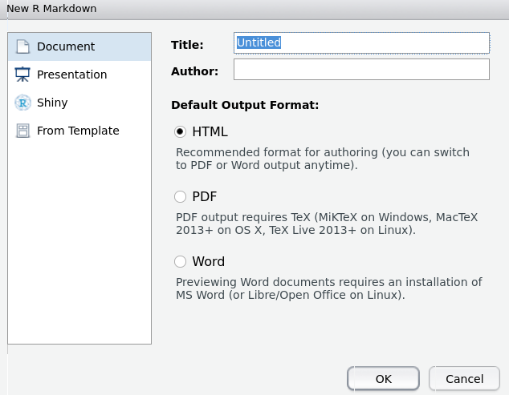
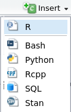
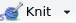

<!-- Este .md fue generado a partir del .Rmd homónimo. Edítese el .Rmd -->
Guía mínima de RMarkdown
========================

Con RMarkdown puedes hacer tu artículo, tu trabajo de la universidad, tu tesis, tu informe, tu presentación de diapositivas, tu página web, tu libro y mucho más. RMarkdown integra las distintas partes de tu trabajo en un único lugar: texto, figuras, referencias bibliográficas, código reproducible y los resultados de dicho código.

RMarkdown es un *notebook* donde puedes hacer todo el flujo de trabajo reproducible para facilitarte la tarea de comunicar tus resultados. Profundiza tus conocimientos sobre RMarkdown con la [versión en español](https://es.r4ds.hadley.nz/r-markdown.html) de Wickham & Grolemund (2017), el cual es igualmente mi referente para este curso. No necesitas más justificación porque, pa'colmo, el tali te exige usar RMarkdown; qué más justificación que esa. Vamo' al mambo.

Lo básico
---------

A continuación verás un extracto de archivo `.Rmd`. Notarás que es simplemente texto plano:

    ---
    output: github_document
    bibliography: biblio.bib
    csl: apa.csl
    ---

    ```{r setup, include=FALSE}
    knitr::opts_chunk$set(
      echo = TRUE,
      collapse=TRUE,
      fig.path = "../img/"
    )
    ```

    <!-- Este .md fue generado a partir del .Rmd homónimo. Edítese el .Rmd -->

    # Introducción a R y análisis exploratorio de datos (EDA)

    ...

    ```{r}
    library(ade4)
    data(doubs)
    ```

    ...

    ### Diagrama de dispersión

    Lee sobre el [diagrama de dispersión](https://es.wikipedia.org/wiki/Diagrama_de_dispersi%C3%B3n).
    Si observas detenidamente las variables `dfs` y `flo` de la [tabla `doubs$env`](#doubs), quizá
    no detectes a golpe de vista que existe correlación entre ambas; es precisamente en este punto
    donde los gráficos te pueden ayudar.

    ```{r, message=FALSE}
    library(tidyverse)
    ```

    ...

    El gráfico de dispersión a continuación muestra que existe  correlación positiva entre las
    variables seleccionadas.

    ```{r intro-doubscatter}
    ggplot(data = doubs$env) +
      geom_point(mapping = aes(x = dfs, y = flo))
    ```

Las tres partes principales son:

-   Encabezado YAML, la parte inicial rodeada de `---`
-   Trozos o bloques de código, rodeados por ```` ``` ````
-   Texto, el cual admite estilos y formatos de texto, como en Markdown pero con más opciones, dependiendo del tipo de archivo de salida que desees generar. Dentro del texto también podrás encontrar comentarios, los cuales verás rodeados por estos símbolos `<!-- ... -->`. Los comentarios no son representados ("renderizarán") en la salida, y sólo quedan visibles en la vista de texto bruto.

Cada una de estas partes las encontrarás bien explicadas en el (capítulo 27 de Wickham & Grolemund, 2017)(<https://es.r4ds.hadley.nz/r-markdown.html>), incluyendo una lista de opciones y punteros a las "hojas de trucos" (*cheatsheet*). No voy a explicar RMarkdown mejor que como está en dicha fuente, así que úsala como manual de referencia.

Para crear un archivo `.Rmd` ve a `File>New File>R Markdown ...`. Un asistente te preguntará qué tipo de salida necesitas. Por ejemplo, puedes elegir documentos PDF, Word, HTML dentro de la sección `Document` del asistente.

<figure>

</figure>

También podrás elegir plantillas de revistas científicas (debes tener instalado el paquete `rticles`) u otras salidas estándar (como archivos Markdown estilo GitHub), yendo a la sección `From Template`.

<figure>

</figure>

Los bloques de código se insertan de la siguiente manera. Coloca el cursor en el lugar que desees iniciar tu código. Presiona el botón verde *Insert* de la barra de herramientas del documento; te aparecerá un menú desde el cual podrás elegir el lenguaje de programación del bloque. Normalmente elegirás R.

<figure>

</figure>

Como ruta alterna, en lugar del menú, puedes presionar la combinación de teclas `Alt+Ctrl+I` y te insertará directamente el bloque en el lugar donde se encuentre el cursor.

Antes generar tu documento de salida (un proceso denominado "tejer" o *knit*, y que explico más adelante), a modo de verificación y para garantizar reproducibilidad, podrás ejecutar los bloques de código de R de tu documento `.Rmd`. De esta manera, podrás probar paulatinamente que tu código funciona adecuadamente. Para ello, coloca el cursor dentro del bloque de código que deseas ejecutar y presiona el botón `Run` , localizado en la barra superior del archivo `.Rmd`; alternativamente puedes usar la combinación de teclas `Ctrl+Shift+Enter`. Puedes ejecutar sólo una línea del bloque, colocando el cursor en la línea que te interesa y presionando `Ctrl+Enter`.

Puedes (debes) configurar el `.Rmd` para que los bloques de código se ejecuten en la consola, haciendo clic en la rueda dentada de la misma barra y eligiendo `Chunk Output in Console`:

<figure>

</figure>

Como mencioné arriba, desde el archivo de texto RMarkdown se genera otro de salida de igual nombre pero con extensión diferente, mediante lo que se denomina "tejer" o *knit* (ver figura abajo, la parte de `pandoc` en adelante aplica para otras salidas diferentes a los `.md`).

<figure>

</figure>
Fuente: Wickham & Grolemund (2017)  

En este curso lo habitual será generar salidas Markdown de GitHub, razón por la que verás en el encabezado de este y otros `.Rmd` del curso la línea `output: github_document`. Para tejer el documento, presiona el botón `knit` ; alternativamente, usa la combinación de teclas `Ctrl+Shift+K`. Esto activará la acción de "tejer" por parte del paquete `knitr` usando como fuente tu archivo `.Rmd`. El tiempo que se tome `knitr` "tejiendo" dependerá mucho de la longitud del documento y del código que tenga que ejecutar.

Debes estar pendiente a los errores (¡vas a tener errores, es inevitable!), que normalmente surgirán tras la ejecución de código mal construido (objetos no declarados, paquetes no cargados, etc.). Por esta razón es importante que, paulatinamente, vayas probando tu código, ejecutándolo en la consola como expliqué arriba. En las asignaciones normalmente daré pistas sobre qué código hay que introducir, pero van surgir problemas y tendrás que resolverlos. Cuando no puedas salir a camino, crea un *issue* **incluyendo código reproducible y mensaje de error**. Una vez `knitr` haya terminado el tejido, creará la salida correspondiente, que en nuestro caso es un documento `.md`.

Toma nota de dos detalles importantes.

1.  Ambos archivos, el `.Rmd` y el `.md`, deberás hacerles *commit*&gt;*push* al repo de GitHub, porque si sólo subes el `.Rmd`, GitHub no lo representará ("renderizará") en HTML; el `.md` sí lo representará apropiadamente, y es por esta razón que necesitarás subirlo conjuntamente.

2.  si haces cambios en el `.Rmd`, y lo guardas pero no presionas *knit*, el `.md` no se actualizará. Cuando empujes tus archivos hacia el repo, el `.md` no te aparecerá en el *commit* (sólo el `.Rmd`) y, por lo tanto, no se sincronizará nada nuevo del `.md` local con el `.md` remoto. El resultado es que tendrás un `.md` sin actualizarse y te escucharás diciendo: "Pero si ya lo actualicé, pero en el repo aparece el viejo".

Servicio público de radio guarachita:
-------------------------------------

-   Si al intentar hacer *knit* el proceso se detiene, no podrás generar el archivo de salida `.md`. Debes observar los mensajes de error y localizar el fallo, que normalmente estará relacionado con código. Si te trancas, *issue* **incluyendo código reproducible y mensaje de error**.

-   Antes de hacer *commit*&gt;*push* al repo, asegúrate de haber guardado y tejido tu `.Rmd`, para que se genere tu documento de salida. Así, cuando hagas *commit*&gt;*push*, elige los dos archivos para que GitHub renderice el `.md` actualizado como HTML.

-   Si escribes en un documento RMarkdown con miras a producir un Markdown de GitHub (enbezado con `output: github_document`), **NO** edites el `.md`, porque si luego de hacerlo (sea accidental o intencionalmente) vuelves al `.Rmd` y presionas "tejer", los cambios que hayas hecho en el primero se perderán.

Referencias
-----------

Wickham, H., & Grolemund, G. (2017). *R for data science: Import, tidy, transform, visualize, and model data* (1st ed.). Retrieved from <http://r4ds.had.co.nz/>
