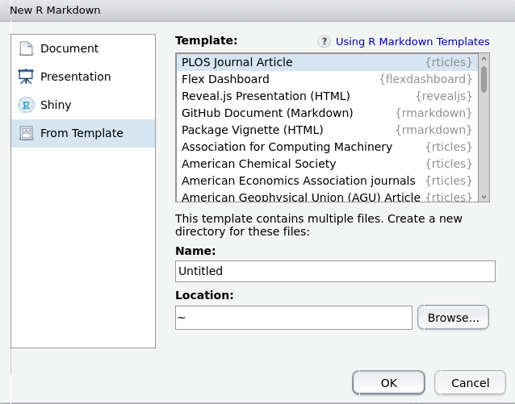
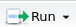
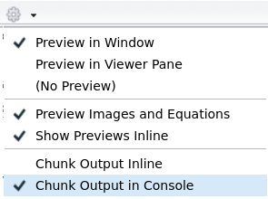

<!-- Este .md fue generado a partir del .Rmd homónimo. Edítese el .Rmd -->
Guía mínima de RMarkdown
========================

Con RMarkdown puedes hacer tu artículo, tu trabajo de la universidad, tu tesis, tu informe, tu presentación de diapositivas, tu página web, tu libro y mucho más. RMarkdown integra las distintas partes de tu trabajo en un único lugar: texto, figuras, referencias bibliográficas, código reproducible y los resultados de dicho código.

RMarkdown es un *notebook* donde puedes hacer todo el flujo de trabajo reproducible para facilitarte la tarea de comunicar tus resultados. Profundiza tus conocimientos sobre RMarkdown con la versión en español de Wickham & Grolemund (2017), el cual es igualmente mi referente. No necesitas más justificación, porque pa'colmo, el tali te exige usar RMarkdown, qué más justificación que esa. Vamo' al mambo.

Lo básico
---------

Tal como verás en el ejemplo a continuación, un archivo `.Rmd` es texto plano:

    ---
    output: github_document
    bibliography: biblio.bib
    csl: apa.csl
    ---

    ```{r setup, include=FALSE}
    knitr::opts_chunk$set(
      echo = TRUE,
      collapse=TRUE,
      fig.path = "../img/"
    )
    ```

    <!-- Este .md fue generado a partir del .Rmd homónimo. Edítese el .Rmd -->

    # Introducción a R y análisis exploratorio de datos (EDA)

    ...

    ```{r}
    library(ade4)
    data(doubs)
    ```

    ...

    ### Diagrama de dispersión

    Lee sobre el [diagrama de dispersión](https://es.wikipedia.org/wiki/Diagrama_de_dispersi%C3%B3n).
    Si observas detenidamente las variables `dfs` y `flo` de la [tabla `doubs$env`](#doubs), quizá
    no detectes a golpe de vista que existe correlación entre ambas; es precisamente en este punto
    donde los gráficos te pueden ayudar.

    ```{r, message=FALSE}
    library(tidyverse)
    ```

    ...

    El gráfico de dispersión a continuación muestra que existe  correlación positiva entre las
    variables seleccionadas.

    ```{r intro-doubscatter}
    ggplot(data = doubs$env) +
      geom_point(mapping = aes(x = dfs, y = flo))
    ```

Las tres partes principales son:

-   Encabezado YAML, la parte inicial rodeada de `---`
-   Trozos o bloques de código, rodeados por ```` ``` ````
-   Texto, el cual admite estilos y formatos de texto, como en Markdown pero con más opciones, dependiendo del tipo de archivo de salida que desees generar. Dentro del texto también podrás encontrar comentarios, los cuales verás rodeados por estos símbolos `<!-- ... -->`. Los comentarios no son representados en la salida, y sólo quedan visibles en la vista bruta.

Cada una de estas partes las encontrarás bien explicadas en el (capítulo 27 de Wickham & Grolemund, 2017)(<https://es.r4ds.hadley.nz/r-markdown.html>), incluyendo una lista de opciones y punteros a las "hojas de trucos (*cheatsheet*). Yo no voy a explicar RMarkdown mejor que como está en dicha fuente, así que úsenla como manual de referencia.

Para crear un archivo `.Rmd` ve a `File>New File>R Markdown ...`. Un asistente te preguntará qué tipo de salida necesitas. Por ejemplo, puedes elegir documentos PDF, Word, HTML dentro de la sección `Document` del asistente, pero también podrás elegir plantillas de revistas científicas u otras salidas estándar (como archivos Markdown estilo GitHub), yendo a la sección `From Template`.

<figure>

</figure>

Cuando tengas un documento de RMarkdown, y crees bloques de código de R, podrás ejecutarlos antes de generar el documento de salida (un proceso denominado "tejer" o *knit*, y que explico más adelante). De esta manera, podrás probar que tu código funciona adecuadamente. Para ello, coloca el cursor dentro del bloque de código que deseas ejecutar y presiona el botón `Run` , localizado en la barra superior del archivo `.Rmd`; alternativamente puedes usar la combinación de teclas `Ctrl+Shift+Enter`. Puedes ejecutar sólo una línea del bloque, colocando el cursor en la línea que te interesa y presionando `Ctrl+Enter`. Puedes (debes) configurar el `.Rmd` para que los bloques de código se ejecuten en la consola, haciendo clic en la rueda dentada de la misma barra y eligiendo `Chunk Output in Console`:

<figure>

</figure>
Como mencioné arriba, desde el archivo de texto RMarkdown se pueden generar diferentes salidas, pero en este curso lo habitual serán Markdown de GitHub (enbezado con `output: github_document`). Pues bien, luego de presionar el botón "tejer", el paquete `knitr` tomará el archivo `.Rmd` y lo convertirá en la salida correspondiente, que en nuestro caso es un documento `.md` (ver figura abajo). Ambos deben "empujarse" (*push*) al repo de GitHub, porque si sólo subes `.Rmd` GitHub no lo representará ("renderizará") en HTML; el `.md` sí lo representará apropiadamente por lo que necesitarás subirlo conjuntamente. Toma nota de este "detallito": si haces cambios en el `.Rmd`, y lo guardas pero no presionas *knit*, el `.md` no se actualizará. Cuando empujes tus archivos hacia el repo, el `.md` no te aparecerá en el *commit* (sólo el `.Rmd`) y, por lo tanto, no se sincronizará nada nuevo del `.md` local con el `.md` remoto. El resultado es que dirás: "Pero si yo lo actualicé ya, y en el repo aparece el viejo".

<figure>

</figure>
Fuente: Wickham & Grolemund (2017)

Servicio público de radio guarachita:
-------------------------------------

-   Antes de hacer *commit*&gt;*push* al repo, asegúrate de haber guardado y tejido tu `.Rmd`, para que se genere tu documento de salida. Así, sincronizarás no sólo tu `.Rmd`, sino también tu `.md` que es el que GitHub renderiza como HTML.

-   Si escribes en un documento RMarkdown con miras a producir un Markdown de GitHub (enbezado con `output: github_document`), **NO** edites el `.md`, porque si luego de hacerlo (sea accidental o intencionalmente) vuelves al `.Rmd` y presionas "tejer", los cambios que hayas hecho en el primero se perderán.

Referencias
-----------

Wickham, H., & Grolemund, G. (2017). *R for data science: Import, tidy, transform, visualize, and model data* (1st ed.). Retrieved from <http://r4ds.had.co.nz/>
