<!-- Este .md fue generado a partir del .Rmd homónimo. Edítese el .Rmd -->
Introducción a R y análisis exploratorio de datos (EDA)
=======================================================

Introducción a R
----------------

### Recursos

Te paso a continuación algunas fuentes (mayoritariamente en español) sobre las aplicaciones que manejarás y otros recursos.

-   Sobre [R](https://www.r-project.org/)
    -   [Vídeo corto sobre la historia de R](https://es.coursera.org/lecture/intro-data-science-programacion-estadistica-r/historia-e-introduccion-a-r-alNk0), donde podrás aprender algunas las características de R y el software libre en general, ventajas y desventajas de R, así como algunas aplicaciones.
    -   [Libro R4DS, R for Data Science](https://r4ds.had.co.nz/), una fuente muy completa realizada principalmente por Wickham & Grolemund (2017), con apoyo de la comunidad R. [Fue traducido recientemente a español](https://es.r4ds.hadley.nz/) por la comunidad R hispanohablante. Es un buen punto de partida. La organización del libro, que priorice el aparato gráfico sobre la parte programática, ayudan a mantener la motivación en el aprendizaje de R. Seguiré este esquema, pero usando datos ecológicos, tanto para las asignaciones, como para este guión de referencia.
    -   [Esta web](https://oscarperpinan.github.io/R/) es bastante completa, y es a la vez un buen lugar de referencia.
    -   [Este libro](https://cran.r-project.org/doc/contrib/rdebuts_es.pdf) está organizado con enfoque de programación, todo un clásico.
    -   La existencia de una diversa y activa comunidad R, motiva a muchos/as usuarios/as a usar este entorno de programación. [Abajo](#twitter) coloqué algunas cuentas de Twitter donde podrás observar en vivo una mínima parte de la actividad de la comunidad R. Hay muchas otras cuentas, foros, sitios web e incluso reuniones periódicas donde podrás interactuar con la comunidad. Te animo a descubrirlas.
    -   [RStudio](https://www.rstudio.com/). Tanto la página de Wikipedia como [este vídeo](https://www.youtube.com/watch?v=5XeFFoTf2IY) explican muy bien en qué consiste este entorno de desarrollo integrado, además de que hace una breve introducción a qué es R.
-   [Git](https://git-scm.com/). Bueno, esta es una larga historia, que parece estar bien resumida en [Wikipedia](https://es.wikipedia.org/wiki/Git). Busca en YouTube, y verás otros aportes.
-   [GitHub](https://github.com/). Se erige como un servicio público para desarrolladores y desarrolladoras. Luce bien explicado [aquí](https://www.deustoformacion.com/blog/programacion-diseno-web/que-es-para-que-sirve-github).
-   [GitHub Classroom](https://github.com/education/classroom%5D). En [esta web](https://www.genbeta.com/desarrollo/classroom-for-github-ayudando-a-los-profesores-a-gestionar-los-ejercicios-de-sus-clases) te explican para qué sirve. Con este servicio estoy asignándote trabajo. También te recomiendo que leas [ésta afirmación](https://github.com/education/classroom#who-is-classroom-for).
-   Foros de ayuda y listas de distribución, entre los que destacan [R-help](https://stat.ethz.ch/mailman/listinfo/r-help), [R-devel](https://stat.ethz.ch/mailman/listinfo/r-devel), [Stackoverflow](https://stackoverflow.com/). Las preguntas deben plantearse con un ejemplo reproducible. Si vas a plantear una, lee antes las guías de publicación. Existe una [lista de distribución de R-help en español](https://stat.ethz.ch/mailman/listinfo/r-help-es), así como de [Stackoverflow en español](https://es.stackoverflow.com/).
-   <a name="twitter"></a>Twitter:
    -   [The R Foundation](https://twitter.com/_r_foundation)
    -   [RStudio](https://twitter.com/rstudio)
    -   [RLadies](https://twitter.com/RLadiesGlobal)
    -   [We Are R-Ladies](https://twitter.com/WeAreRLadies)
    -   [Comunidad R Hispano](https://twitter.com/r_hisp?lang=es)
    -   [Hadley Wickham](https://twitter.com/hadleywickham)
    -   [Gabriela de Queiroz](https://twitter.com/gdequeiroz)
    -   [R Consortium](https://twitter.com/rconsortium)
    -   [UseR! 2020](https://twitter.com/useR2020stl)
    -   [UseR! 2019](https://twitter.com/UseR2019_Conf)
    -   [Rstats](https://twitter.com/rstatstweet)

### Instalación y ejecución de R y RStudio

-   Puedes usar el servidor RStudio habilitado por el profesor. Habrás recibido un correo electrónico con los detalles de acceso.

-   Si prefieres trabajar en tu propia PC, instala R y RStudio. La guía de instalación varía mucho según el sistema operativo:
    -   [R](https://cloud.r-project.org/)
    -   [RStudio](https://www.rstudio.com/products/rstudio/download/#download)
-   Igualmente, la forma de ejecutar estas aplicaciones dependerá del sistema operativo.
    -   En GNU/Linux es posible ejecutar tanto aplicaciones tanto desde el gestor de ventanas como desde el intérprete de línea de órdenes (CLI) o "terminal" (por ejemplo, para ejecutar R, presiona `CRTL+ALT+T`, escribe `R` y presiona `<enter>`).
    -   En Windows y MacOS la ejecución se realiza desde el GUI.

### CRAN (Comprehensive R Archive Network)

-   [¿Qué es CRAN?](https://cran.r-project.org/doc/FAQ/R-FAQ.html#What-is-CRAN_003f)
-   Instalar paquetes: Ejemplo: `install.packages('vegan', dependencies = T)`. Si realizas tus asignaciones en el servidor RStudio habilitado por el profesor, no necesitarás instalar paquetes.

### Ayuda de R

``` r
help(package = 'base') #Ayuda sobre un paquete
library(help = 'base') #Documentación sobre un paquete
help(lm) #Ayuda sobre una función
?lm #Ídem
example(lm) #Ejemplo(s) sobre una función
help.search("matrix") #Busca la palabra clave en las ayudas de los paquetes
??matrix #Ídem
```

¡Usa los foros! Si introduces un mensaje de error de R en el buscador de tu preferencia (en inglés obtienes más resultados), encontrarás varios punteros a foros con posibles soluciones.

Análisis exploratorio de datos (EDA)
------------------------------------

Wickham & Grolemund (2017) afirman que, durante la producción de resultados comunicables, subyace la necesidad de realizar el **análisis exploratorio de datos (AED o EDA)** lo más rápidamente posible, pero nunca obviarlo. Subyace la idea de que es necesario aligerar el EDA para descubrir tantos patrones como sea posible sin que haya "pelearse" con los datos para hacer simples gráficos. Esto permitirá al investigador/a concentrarse en interpretar resultados. El esquema a continuación, de la misma fuente, resume este proceso:


**Las múltiples herramientas ofrecidas por los paquetes de la colección `tidyverse` te servirán para agilizar sustancialmente el EDA**. Los paquetes `dplyr`, `tidyr` y otros, te ayudarán a importar, ordenar y transformar datos, mientras `ggplot2` te ayudará a crear gráficos estilizados eficientemente. Wickham & Grolemund (2017) aseguran que estas herramientas mantienen la motivación en el aprendizaje por sus flujos de trabajo lineales.

### El conjunto de datos `doubs`

Una de las fuentes que utilizo en esta guía de referencia, es el conjunto de datos `doubs` de Verneaux (1973). Se cargan meidante el paquete `ade4`. Estos datos se utilizan también en Borcard, Gillet, & Legendre (2018).

``` r
library(ade4)
data(doubs)
```

> **Nota**. Si no usas el servidor RStudio habilitado por el profesor, instala `ade4` (y cualquier otro paquete usado en este tutorial) con `install.packages('ade4', dependencies = T)`

La sentencia anterior carga el objeto `doubs` a memoria, pero no lo imprime en pantalla. `doubs` es una lista de 4 tablas o `data.frame`, etiquetadas como `env`-matriz ambiental, `fish`-matriz de comunidad usando abundancia semi-cuantitativa (más explicación abajo), `xy`-matriz de coordenadas de las muestras y `species`-nombres de las 27 especies encontradas. Las filas de los tres primeros `data.frame` corresponden a 30 sitios muestreados a lo largo del río franco-suizo Doubs.

<a name="doubs"></a>Como ves, el objeto `doubs` se compone de varios elementos, por lo que es preferible imprimirlo en pantalla por separado. Para imprimir sólo un objeto de una lista, se usa el operador `$`. Así, `doubs$env`, imprime sólo la matriz ambiental.

> Nota. Fíjate que tanto en estos datos de ejemplo, como en los siguientes, utilizaré una combinación de funciones y operadores para mostrar sólo una parte de las tablas. Esta operación la podemos denominar "filtrado". Si la omitimos, la consola de R se desbordaría, y se generaría un documento innecesariamente largo. Más adelante descompongo en trocitos los pasos necesarios para filtrar, porque en tus asignaciones tendrás que hacerlo.

``` r
set.seed(98)
doubs$env[sample(1:30, 6), ] #Sólo 6 filas mostradas, elegidas al azar
##     dfs alt   slo  flo pH har pho nit amm oxy bdo
## 15 1645 415 1.792 2300 86  86  40 100   0 117  21
## 10  990 617 4.605 1000 77  82   6  75   1 100  43
## 29 4220 183 1.946 6770 78 110  45 162  10  90  42
## 13 1436 450 3.091 2110 81  98   6  52   0 124  24
## 7   268 841 4.205  400 81  88   7  15   0 111  22
## 8   491 792 3.258  130 81  94  20  41  12  70  81
```

`doubs$env` contiene información ambiental de los 30 sitios de colecta (filas) con las siguientes variables (columnas): `dfs`-distancia desde cabecera (en km x 10), `alt`-altitud (en m), `slo`-pendiente (log(x+1), donde x es la pendiente en tantos por 1000), `flo`-caudal promedio mínimo (m<sup>3</sup>/s 100), `pH` ( x 10), `har`-dureza del agua (mg/l de calcio), `pho`-fostados (mg/l x 100), `nit`-nitratos, `amm`-amoníaco (mg/l x 100), `oxy`-oxígeno disuelto (mg/l x 100), `bdo`-demanda biológica de oxígeno (mg/l x 10)

La tabla `doubs$fish`, asociada a la anterior, contiene la abundancia de especies por sitio. Los valores de las celdas no son individuos; la abundancia está representada en una escala semi-cuantitativa específica por especie, que va de 0 a 5, es decir, se trata de una escala de pseudo-abundancia más propiamente. Por lo tanto, los valores no pueden entenderse como estimadores insesgados de la abundancia real o de la biomasa por sitio (Borcard et al., 2018).

``` r
set.seed(99)
doubs$fish[sample(1:30, 6), sample(1:27, 6)] #Sólo 6 filas y columnas mostradas, elegidas al azar
##    Rham Phph Scer Ruru Gogo Icme
## 21    3    1    2    5    5    1
## 9     0    1    0    4    0    0
## 11    0    4    0    0    0    0
## 5     0    3    2    5    2    0
## 15    0    4    0    0    2    0
## 13    0    5    0    0    0    0
```

Determinados gráficos de ordenación se vuelven ilegibles cuando se usan los nombres completos de las especies. Por tal razón, es práctica común abreviarlos, tal como verás en los nombres de columnas, donde se usan abreviaturas de cuatro caracteres. La correspondencia entre estas abreviaturas y los nombres completos de las especies, se encuentra explicada en la tabla `doubs$species`.

``` r
doubs$species
##                     Scientific             French           English code
## 1                 Cottus gobio             chabot european bullhead Cogo
## 2           Salmo trutta fario       truite fario       brown trout Satr
## 3            Phoxinus phoxinus             vairon            minnow Phph
## 4       Nemacheilus barbatulus      loche franche       stone loach Neba
## 5          Thymallus thymallus              ombre          grayling Thth
## 6     Telestes soufia agassizi            blageon           blageon Teso
## 7           Chondrostoma nasus               hotu              nase Chna
## 8       Chondostroma toxostoma          toxostome         toxostoma Chto
## 9          Leuciscus leuciscus           vandoise       common dace Lele
## 10 Leuciscus cephalus cephalus           chevaine              chub Lece
## 11               Barbus barbus barbeau fluviatile            barbel Baba
## 12       Spirlinus bipunctatus            spirlin           spirlin Spbi
## 13                 Gobio gobio             goujon           gudgeon Gogo
## 14                 Esox lucius            brochet              pike Eslu
## 15           Perca fluviatilis  perche fluviatile             perch Pefl
## 16              Rhodeus amarus           bouviere        bitterling Rham
## 17            Lepomis gibbosus      perche-soleil       pumpkinseed Legi
## 18  Scardinius erythrophtalmus           rotengle              rudd Scer
## 19             Cyprinus carpio              carpe              carp Cyca
## 20                 Tinca tinca             tanche             tench Titi
## 21               Abramis brama              breme  freshwater bream Abbr
## 22             Ictalurus melas       poisson chat    black bullhead Icme
## 23              Acerina cernua           gremille             ruffe Acce
## 24             Rutilus rutilus             gardon             roach Ruru
## 25             Blicca bjoerkna   breme bordeliere      silver bream Blbj
## 26           Alburnus alburnus            ablette             bleak Alal
## 27           Anguilla anguilla           anguille               eel Anan
```

Las cuatro columnas corresponden a: `Scientific`-nombre científico, `French` y `English`-nombres comunes en francés y en inglés, `code` códigos de cuatro caracteres usados como nombres de columnas en la tabla `doubs$fish`.

### El conjunto de datos `BCI`

`BCI` es una matriz de comunidad, muy popular en ecología, porque se utiliza como conjunto de datos modelo en el paquete `vegan`, muy usado en ecología (Oksanen et al., 2013). `BCI` contiene conteos (abundancias reales) de árboles de al menos 10 cm de diámetro a la altura de pecho (DAP o *DBH*) registrados en 50 parcelas (filas de la matriz) de 1 hectárea cada una, para un total de 225 especies (columnas de la matriz). Los nombres científicos se muestran íntegramente, aunque el espacio separador entre género y especie es sustituido por un `.`. A continuación se muestra una selección aleatoria de 6 parcelas y 3 especies de la matriz de comunidad.

``` r
library(vegan)
data(BCI)
set.seed(10)
BCI[sample(1:50, 6), sample(1:225, 3)] #Sólo 6 filas y 3 columnas mostradas, elegidas al azar
##    Lacmellea.panamensis Eugenia.nesiotica Hirtella.americana
## 35                    1                 0                  0
## 5                     2                 0                  0
## 11                    0                 0                  0
## 13                    1                 2                  0
## 47                    2                 1                  0
## 28                    0                 1                  0
```

En el mismo paquete se encuentra también la matriz ambiental `BCI.env`, asociada a la anterior. `BCI.env` es un `data.frame` de 50 parcelas (filas) y nueve variables de sitio (columnas) descritas a continuación. `UTM.EW` y `UTM.NS`-coordenadas UTM de falso Este y falso Norte (zona 17N), `Precipitation`-precipitación en mm por año, `Elevation`-elevación en metros sobre el nivel del mar, `Age.cat`-categoría de edad del bosque, `Geology`-formación geológica subyacente, `Habitat`-tipo hábitat dominante predominante, `Stream`-"*Yes*" si hay un hábitat de ribera fluvial en la parcela, `EnvHet`-heterogeneidad ambiental evaluada por medio de la diversidad de frecuencia de tipos de hábitat de Simpson en 25 celdas de cuadrícula dentro de la parcela. Puedes consultar información detallada sobre cada variable en Harms, Condit, Hubbell, & Foster (2001).

``` r
data(BCI.env)
set.seed(11)
BCI.env[sample(1:50, 6), ] #Sólo 6 filas mostradas, elegidas al azar
##    UTM.EW  UTM.NS Precipitation Elevation Age.cat Geology  Habitat Stream
## 14 625954 1011869          2530       120      c3      Tb   OldLow     No
## 1  625754 1011569          2530       120      c3      Tb OldSlope    Yes
## 25 626154 1011969          2530       120      c3      Tb   OldLow     No
## 49 626654 1011869          2530       120      c3      Tb   OldLow     No
## 3  625754 1011769          2530       120      c3      Tb   OldLow     No
## 43 626554 1011769          2530       120      c3      Tb OldSlope     No
##    EnvHet
## 14 0.1472
## 1  0.6272
## 25 0.6080
## 49 0.4992
## 3  0.0000
## 43 0.0768
```

### El conjunto de datos `mite`

`mite` es un conjunto de tres `data.frame` sobre ácaros oribatidos y sus variables ambientales, colectados en 70 sitios mediante núcleos de suelo en una parcela de 2.5 x 10 m, los cuales fueron publicados en dos trabajos (Borcard & Legendre, 1994; Borcard, Legendre, & Drapeau, 1992). Al igual que los anteriores, este conjunto de datos se carga a través del paquete `vegan`. El primero, `mite` propiamente, contiene la matriz de comunidad con los datos de abundancia de 35 especies (columnas) de ácaros oribátidos para cada uno de los 70 sitios (filas).

``` r
data(mite)
set.seed(40)
mite[sample(1:70, 6), sample(1:35, 6)] #Sólo 6 filas y 6 columnas mostradas, elegidas al azar
##    PPEL Miniglmn Trhypch1 RARD MEGR ONOV
## 15    2        1        0    0    1    7
## 41    0        0        0    0    0    5
## 26    0        0        0    1    1   27
## 10    0        2        0    3    0   33
## 7     0        0        0    2    3   27
## 46    0        0        0    0    2   22
```

`mite.env` contiene datos ambientales de los sitios de colecta, que incluye `SubsDens`-densidad del sustrato (g/L); `WatrCont`-contenido de agua del substrato (g/L); `Substrate`-tipo de substrato, pudiendo tomar los valores `Sphagn1`, `Sphagn2`, `Sphagn3`, `Sphagn`, `Litter`, `Barepeat` e `Interface`; `Shrub`-que indica la densidad de arbustos, pudieno tomar tres posibles niveles `None` (ninguno), `Few` (pocos) o `Many` (muchos); finalmente la variable `Topo`-que puede tomar los valores `Blanket` y `Hummock`.

``` r
data(mite.env)
set.seed(30)
mite.env[sample(1:70,6),] #Sólo 6 filas mostradas, elegidas al azar
##    SubsDens WatrCont Substrate Shrub    Topo
## 7     36.95   378.93   Sphagn1   Few Hummock
## 34    53.17   367.11 Interface  Many Blanket
## 25    35.30   293.49 Interface  Many Blanket
## 29    32.86   323.12 Interface  Many Hummock
## 20    38.61   145.68 Interface  Many Hummock
## 10    32.14   220.73   Sphagn1  Many Hummock
```

Finalmente, `mite.xy` contiene las coordenadas (con origen arbitrario) de los 70 sitios.

``` r
data(mite.xy)
set.seed(50)
mite.xy[sample(1:70,6),] #Sólo 6 filas mostradas, elegidas al azar
##       x   y
## 50 0.60 6.9
## 31 0.20 4.7
## 14 2.00 2.3
## 52 0.05 7.3
## 34 1.00 5.3
## 3  1.20 0.3
```

### Un **"detallito"** sobre matrices de comunidad y ambientales en R

**La mayoría de los paquetes para análisis en ecología asumen que el orden de las filas de las matrices de comunidad y ambiental es consistente**. Por ejemplo, `vegan` asume que la fila `n` de las matrices de comunidad y ambiental se refiere al mismo "sitio". Es decir, la fila `n` informa por un lado del mismo sitio sobre las especies, y por otro sobre las variables ambientales. Si por accidente, o deliberadamente, las filas se reordenaran en una matriz, sin hacerlo igualmente en la otra, cualquier análisis que intente poner en relación datos composicionales con ambientales será fútil e inconsistente.

Se trata de un **pequeño detalle a tener muy presente** al momento de manipular datos ecológicos. Una medida para evitar posibles errores, sería crear columnas de nombres de sitios a partir de los nombres de filas en ambas matrices, justo después de cargarlas. Si se perdiera la integridad entre ambas siempre se podrían hacer uniones a partir de dichas columnas.

### Una pequeña parada para explicar cómo filtrar

Habrás notado en las sentencias anteriores que utilicé una combinación de funciones (`set.seed` y `sample`) y el operador `[`. Aunque con la colección `tidyverse` verás una sintaxis más "fluida" para filtrar `data.frame`, en este apartado lo haré usando los operadores `[` y `<-`, así como las funciones `subset`, `set.seed`, `sample` y `nrow`, todas del paquete `base`.

Supón que el tali te pide que separes, de la matriz de comunidad `BCI`, un subconjunto aleatorio de 15 muestras (cada muestra es una fila). Primero crearé un objeto que contenga el número de filas de `BCI` y, posteriormente, de ese número total pediré que tome una muestra de 15 números.

El primer paso, crear el objeto con el número de filas de `BCI`, lo realizo con la función `nrow` (*number of rows*), asignando su resultado a un nuevo objeto, que denomino `nfbci`. Fíjate que, para crear dicho objeto es necesario incluir el operador de asignación (`<-`); míralo como una flecha, hacia donde apunta es el nombre del objeto nuevo que deseo crear (`nfbci`), mientras que el lado contrario contiene el valor que asumirá dicho objeto, `nrow(BCI)`. Cuando el objeto `nfbci` es impreso en pantalla devuelve el valor 50, que es el número de filas de `BCI`.

Bien, ahora que tenemos el número de filas de `BCI`, hay que seleccionar 15 números aleatorios entre el 1 y el 50. El objeto `quincefilas` toma el valor del resultado de la función `sample(1:nfbci, 15)`. Los argumentos de esta función se explican así: el primer argumento es `1:nfbci`, que devuelve un vector de 50 números, del 1 al 50, en orden secuencial. El segundo argumento de la función es el número de valores a seleccionar del vector, que en este caso es 15. Así, `quincefilas` es un vector de 15 elementos, cuyos valores se encuentran entre 1 y 50.

> Nota. La función `set.seed` sirve para garantizar que este ejemplo sea reproducible, porque fija una "semilla" (forma de colectar datos en el generador de números aleatorios). El número dentro de dicha función es arbitrario. Así, con independencia de las veces que ejeuctes este ejemplo, `set.seed` garantizará que siempre se elijan los mismo 15 números. Prueba excluyendo la función, y notarás que en cada corrida obtienes conjuntos diferentes de 15 números diferentes.

Finalmente, introducimos el vector `quincefilas` dentro de los corchetes luego de `BCI` y lo asignamos a `miBCI`. Veamos dicha línea descompuesta en partes. Denominemos `x` a un `data.frame`. Podemos filtrar a `x` mediante índices de extracción de filas `i` y columnas `j`, de la siguiente manera: `x[i,j]`. Como ves, el índice de filas corresponde a la primera parte dentro de los corchetes, y el índice de columnas a la segunda. Así, si necesito la fila 1 de `x`, con todas sus columnas, sólo escribo `x[1,]`; si sólo necesito la fila 1 columna 1 ejecuto `x[1,1]`. En el caso que nos ocupa abajo, `BCI` es el `data.frame`, y el índice de filas es el objeto `quincefilas`. Dado que no especifico columnas, las devuelve todas. Así, el nuevo `miBCI` es un subconjunto de `BCI`, con quince filas elegidas aleatoriamente. Nota que al asignar no se especifican columnas, pero al imprimir sí especifico columnas (`miBCI[,1:3]`), concretamente las tres primeras, para así evitar desbordar el documento. A continuación te explico cómo explorar la estructura básica de la matriz de comunidad.

``` r
nfbci <- nrow(BCI)
nfbci
## [1] 50
set.seed(300)
quincefilas <- sample(1:nfbci, 15)
quincefilas
##  [1] 46 38 39 35 32  1 34 22 20 37 49 13 31 43 24
miBCI <- BCI[quincefilas,]
miBCI[,1:3]
##    Abarema.macradenia Vachellia.melanoceras Acalypha.diversifolia
## 46                  0                     0                     0
## 38                  0                     0                     0
## 39                  0                     0                     0
## 35                  0                     0                     0
## 32                  0                     1                     0
## 1                   0                     0                     0
## 34                  0                     0                     1
## 22                  0                     0                     0
## 20                  0                     0                     0
## 37                  0                     0                     0
## 49                  0                     0                     0
## 13                  0                     0                     0
## 31                  0                     0                     0
## 43                  0                     0                     0
## 24                  0                     0                     0
```

### Básicos de una matriz de comunidad

Una de las primeras tareas en el EDA consiste en saber cuántos sitios y cuántas especies tiene nuestra muestra. Veamos todas las matrices comunidad, compáremoslas. El número de sitios es equivalente al número de filas, por lo que se puede determinar con la siguiente sentencia:

> Nota. Recuerda que la matriz de comunidad del conjunto de datos `doubs` es un `data.frame` dentro de una lista, y se obtiene por medio de `doubs$fish`.

``` r
nrow(doubs$fish)
## [1] 30
```

El número de especies por sitio se cuenta con la función `specnumber` del paquete `vegan`. La función sólo cuenta aquellas columnas que no tengan ceros.

``` r
specnumber(doubs$fish)
##  1  2  3  4  5  6  7  8  9 10 11 12 13 14 15 16 17 18 19 20 21 22 23 24 25 
##  1  3  4  8 11 10  5  0  5  6  6  6  6 10 11 17 22 23 23 22 23 22  3  8  8 
## 26 27 28 29 30 
## 21 22 22 26 21
```

Nota que la parte superior del resultado es el nombre del sitio, y la inferior es el número de especies. Por ejemplo, el sitio 1 tiene 1 especie, el 2 tiene 3, el 3 tiene 4, el 4 tiene 8, ..., el 30 tiene 21.

Notarás que los sitios están ordenados según el orden secuencial de filas, y por ello no vemos claramente cuál sitio tiene mayor riqueza y cuál tiene la menor. Mejor ordenamos el resultado...

``` r
sort(specnumber(doubs$fish))
##  8  1  2 23  3  7  9 10 11 12 13  4 24 25  6 14  5 15 16 26 30 17 20 22 27 
##  0  1  3  3  4  5  5  6  6  6  6  8  8  8 10 10 11 11 17 21 21 22 22 22 22 
## 28 18 19 21 29 
## 22 23 23 23 26
```

...y nos damos cuenta rápidamente que el sitio 29 es el de mayor riqueza numérica, y que en el sitio 8 no se registró ninguna especie. Si aplicamos estas mismas sentencias a los demás conjntos de datos veremos resultados interesantes.

``` r
#BCI
nrow(BCI)
## [1] 50
sort(specnumber(BCI))
##  31  40  44  45   7  38  35   2  12  39   6  28  29  33  43  46  11  42 
##  77  80  81  81  82  82  83  84  84  84  85  85  86  86  86  86  87  87 
##   8  32  37  18   3   9  22  26  48  49  34  36   1  13  15  16  17  50 
##  88  88  88  89  90  90  91  91  91  91  92  92  93  93  93  93  93  93 
##   4  10  24  30  14  21  23  27  20   5  41  47  25  19 
##  94  94  95  97  98  99  99  99 100 101 102 102 105 109

#mite
nrow(mite)
## [1] 70
sort(specnumber(mite))
## 44 57 62 67 59 54 29 55 61 42 39 41 50 56 58 40 43 48 52 60 24 49 64 65 68 
##  5  5  6  6  7  8  9  9  9 10 11 11 11 11 11 12 12 12 12 12 13 13 13 13 13 
## 17 22 38 47 51 66 23 31 53 70  7  9 21 32 33 37 46 63 16 26 45 69 13 15 18 
## 14 14 14 14 14 14 15 15 15 15 16 16 16 16 16 16 16 16 17 17 17 17 18 18 18 
## 28 35 36  3  5 10 12 25  1 20  6  8 19 30 34 27  2  4 14 11 
## 18 18 18 19 19 19 19 19 20 20 21 21 21 21 21 22 23 23 23 25
```

Un resultado que también debe salir del EDA es la riqueza de la toda la muestra. Para ello necesitamos que `vegan` vea nuestra matriz de forma combinada (*pooled*), lo cual haremos con la función `colSums`. Así, generamos un vector que contiene las sumas de individuos por especie (en el caso del conjunto `doubs` no, por tratarse de una matriz de escala semi-cuantitativa). A dicha matriz le podemos calcular su riqueza numérica con `specnumber`.

``` r
# doubs
doubs_comb <- colSums(doubs$fish)
doubs_comb
## Cogo Satr Phph Neba Thth Teso Chna Chto Lele Lece Baba Spbi Gogo Eslu Pefl 
##   15   57   68   73   15   19   18   26   43   56   43   27   55   40   36 
## Rham Legi Scer Cyca Titi Abbr Icme Acce Ruru Blbj Alal Anan 
##   33   29   21   25   45   26   18   38   63   31   57   27
specnumber(doubs_comb)
## [1] 27

# BCI
BCI_comb <- colSums(BCI)
BCI_comb[1:20] #Dado que son tantas especies, imprimo sólo las primeras 20
##       Abarema.macradenia    Vachellia.melanoceras    Acalypha.diversifolia 
##                        1                        3                        2 
##    Acalypha.macrostachya           Adelia.triloba     Aegiphila.panamensis 
##                        1                       92                       23 
##  Alchornea.costaricensis      Alchornea.latifolia         Alibertia.edulis 
##                      156                        1                        1 
##  Allophylus.psilospermus         Alseis.blackiana        Amaioua.corymbosa 
##                       27                      983                        3 
##      Anacardium.excelsum           Andira.inermis          Annona.spraguei 
##                       22                       28                       27 
##            Apeiba.glabra         Apeiba.tibourbou  Aspidosperma.desmanthum 
##                      236                       21                       52 
## Astrocaryum.standleyanum     Astronium.graveolens 
##                      201                       39
specnumber(BCI_comb)
## [1] 225

# mite
mite_comb <- colSums(mite)
mite_comb
##   Brachy     PHTH     HPAV     RARD     SSTR  Protopl     MEGR     MPRO 
##      611       89      596       85       22       26      153       11 
##     TVIE     HMIN    HMIN2     NPRA     TVEL     ONOV     SUCT     LCIL 
##       58      344      137      132      634     1209     1187     2468 
## Oribatl1 Ceratoz1     PWIL Galumna1 Stgncrs2     HRUF Trhypch1     PPEL 
##      132       90       76       67       51       16      183       12 
##     NCOR     SLAT     FSET Lepidzts Eupelops Miniglmn     LRUG    PLAG2 
##       79       28      130       12       45       17      730       56 
## Ceratoz3 Oppiminu Trimalc2 
##       91       78      145
specnumber(mite_comb)
## [1] 35
```

### Diagrama de dispersión

Lee sobre el [diagrama de dispersión](https://es.wikipedia.org/wiki/Diagrama_de_dispersi%C3%B3n). Si observas detenidamente las variables `dfs` y `flo` de la [tabla `doubs$env`](#doubs), quizá no detectes a golpe de vista que existe correlación entre ambas; es precisamente en este punto donde los gráficos te pueden ayudar.

``` r
library(tidyverse)
```

> **Nota**. Si no realizas tu asignación en el servidor RStudio habilitado por el profesor, debes asegurarte de instalar la colección `tidyverse` (`install.packages(tidyverse, dependencies=T)`).

El gráfico de dispersión a continuación muestra que existe correlación positiva entre las variables seleccionadas.

``` r
ggplot(data = doubs$env) +
  geom_point(mapping = aes(x = dfs, y = flo))
```

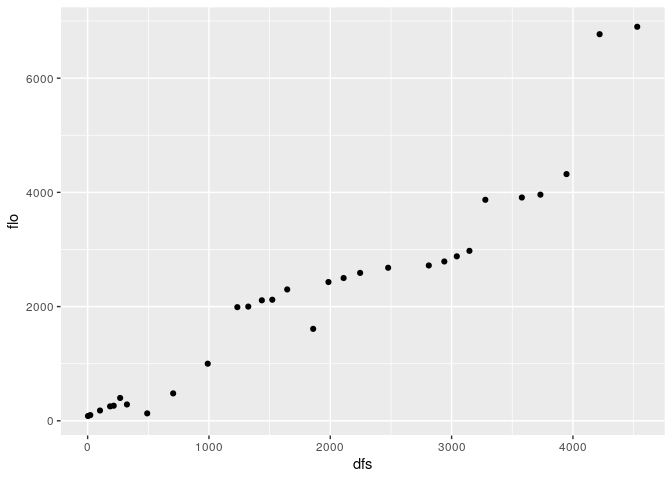

Lógicamente, como es de esperar, a mayor distancia de la cabecera, mayor el caudal. Destacan también dos observaciones atípicas en el extremo superior derecho del gráfico, que corresponden a dos puntos de colecta que obtuvieron valores de flujo muy altos. Volveré sobre estos valores extremos (*outliers*) maś adelante.

`ggplot` crea el sistema de coordenadas a partir del objeto introducido en el argumento `data`, es decir, a partir del conjunto de datos (`ggplot` convierte este objeto a un `data.frame` si al entrar en la función aún no lo es). Por lo tanto, si ejecutaras `ggplot(data = dfs_flo)` obtendrás un gráfico vacío.

A partir de este punto, se pueden añadir una o más capas. En este caso, se añadió una de puntos mediante `geom_point`. Las capas usan el argumento `mapping` para definir la posición y el rol de cada variable en el gráfico. Por lo tanto, los elementos básicos son crear el sistema de coordenadas (`ggplot`), especificar los datos, crear una capa (e.g. `geom_point`) y decclarar cómo se posicionarán las variables. [Aquí](https://www.rstudio.com/wp-content/uploads/2015/03/ggplot2-cheatsheet.pdf) tienes una guía de referencia sobre las capas más comunes.

Puedes editar la forma y el tamaño de todos los elementos del gráfico: rótulos, simbología, cuadrícula, ejes, etc. Existen múltiples argumentos disponibles para gráficos estéticos, que encontrarás en guías de `ggplot2` en línea, como [ésta](https://www.rdocumentation.org/packages/ggplot2/versions/3.2.1) y [esta](https://swcarpentry.github.io/r-novice-gapminder-es/08-plot-ggplot2/index.html). También puedes ver [esta galería](http://www.ggplot2-exts.org/gallery/) para conocer distintas formas de visualizar datos. Puedes también consultar Wickham (2016), un material de contenido exhaustivo y de referencia, donde verás las distintas capas y configuraciones estéticas.

Mostraré los puntos en función de su condición de *outliers*, utilizando distintos colores y formas. No prestes mucha atención a la primera línea de código, sino al gráfico resultante

``` r
flo_outlier <- ifelse(
  doubs$env$flo %in% invisible(boxplot(doubs$env$flo)$out),
  'outlier', 'no outlier')
```

``` r
ggplot(data = doubs$env) +
  geom_point(mapping = aes(x = dfs, y = flo, colour = flo_outlier))
```

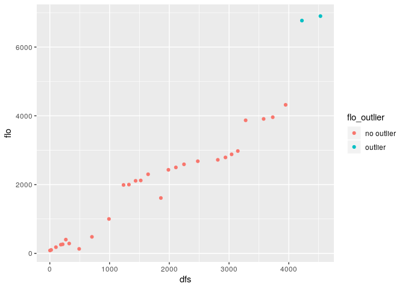

``` r
ggplot(data = doubs$env) +
  geom_point(mapping = aes(x = dfs, y = flo, size = flo_outlier))
## Warning: Using size for a discrete variable is not advised.
```

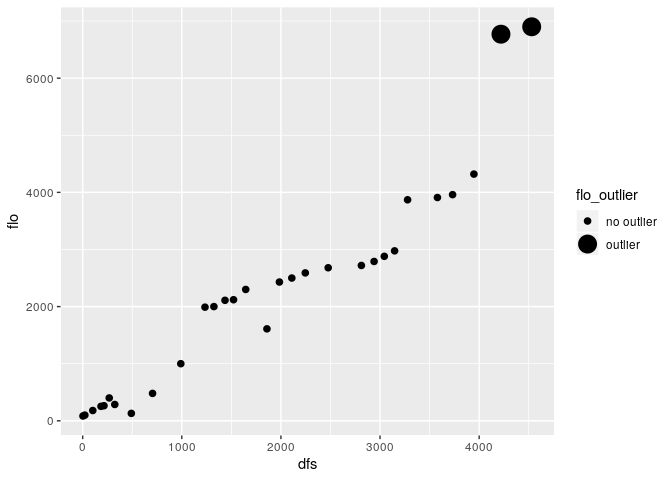

``` r
ggplot(data = doubs$env) +
  geom_point(mapping = aes(x = dfs, y = flo, shape = flo_outlier))
```

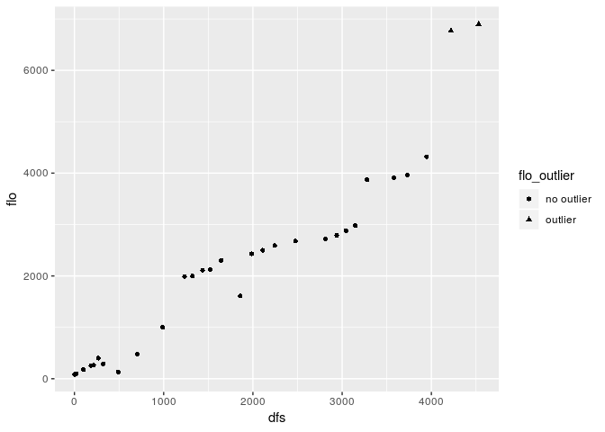

El estético `size` admite variables cuantitativas. El gráfico a continuación nos informa con bastante propiedad sobre una combinación de variables, usando la elevación como estético de tamaño y dureza del dureza del agua como color. Nótese, por ejemplo, que la elevación y están inversamente relacionados, a menor elevación (círculos más pequeños) mayor dureza (rellenos más azules).

``` r
ggplot(data = doubs$env) +
  geom_point(mapping = aes(x = dfs, y = flo, size = alt, colour = har))
```

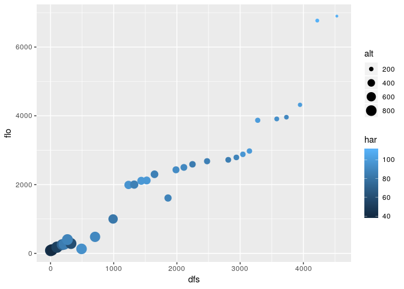

Aunque no son muy informativos sin barras de error, los diagramas de barras pueden ser útiles en determinados contextos. Utilizaré la escala semi-cuantitativa de abundancia (pseudo-abundancia) para responder a la pregunta: ¿Cuál es el nivel de pseudo-abundancia predominante de `Salmo trutta fario` en la muestra?

``` r
ggplot(data = doubs$fish) + geom_bar(mapping = aes(x=Satr))
```

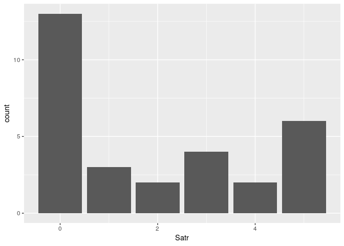

Este gráfico "informa" que el nivel de de pseudo-abundancia más común es 0, es decir, la subespecie está ausente en 13 de los 30 sitios, con lo que es más común no encontrarla. Si ordenásemos las pseudo-abundancias de `Satr` de menor a mayor, podríamos igualmente notar este patrón, lo cual sugiere que el gráfico no aporta mucho más que lo que lo haría un vector ordenado.

``` r
sort(doubs$fish[,2])
##  [1] 0 0 0 0 0 0 0 0 0 0 0 0 0 1 1 1 2 2 3 3 3 3 4 4 5 5 5 5 5 5
```

Fíjate en este otro gráfico de barras usando el conjunto de datos `BCI`. El argumento `fill` en el segundo gráfico rellena las barras de manera que se pueden diferencias los distintos hábitat con mayor facilidad. Es posible configurar los colores en cada caso con la funcipon `scale_fill_discrete`

``` r
ggplot(data = BCI.env) +  geom_bar(mapping = aes(x = Habitat))
```

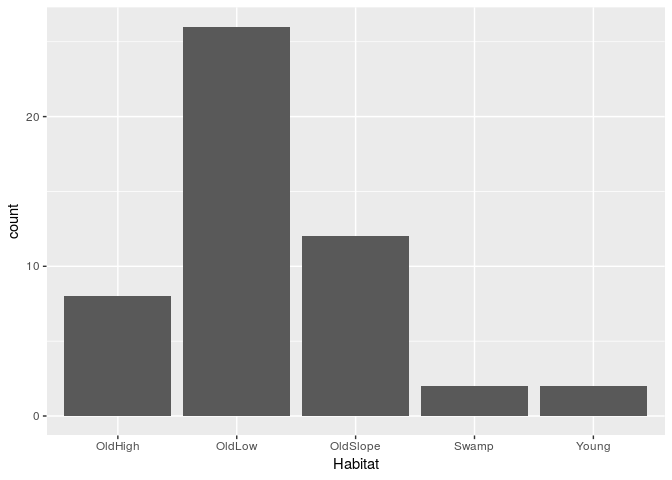

``` r

ggplot(data = BCI.env) +
  geom_bar(mapping = aes(x = Habitat, fill = Habitat))
```

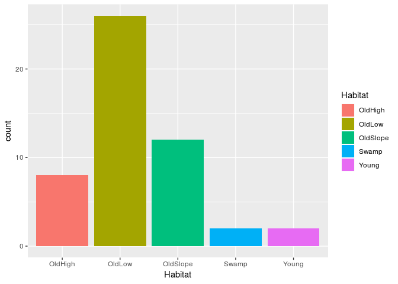

Nota que hay dos hábitats escasamente representados, que son *Swamp* y *Young*. El EDA está informando que, en determinados análisis, estos grupos no aportarían efectos sistemáticos o, en su defecto, harían que determinados supuestos no se cumplieran. No entraré en detalles del filtro que apliqué a los datos para excluir ambos grupos (más adelante verás cómo usar `tidyverse` para filtrar datos y otras tareas), así que ignora la parte "fea" del código y fíjate en el gráfico.

``` r
grupos_numerosos <- droplevels(
  BCI.env[!BCI.env$Habitat %in% c('Swamp', 'Young'), ]
)
ggplot(data = grupos_numerosos) +
  geom_bar(mapping = aes(x = Habitat, fill = Habitat))
```

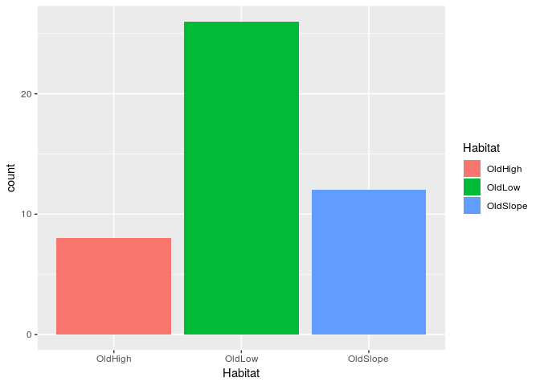

Para variables cuantitativas, el diagrama de cajas, mejor conocido como *boxplot*, es sin duda un apoyo fundamental. Te recomiendo la [entrada de Wikipedia](https://es.wikipedia.org/wiki/Diagrama_de_caja) sobre este útil gráfico. A golpe de vista, verás a continuación la variable "heterogeneidad ambiental" según hábitats, utilizando el objeto `grupos_numerosos` creado en el trozo de código anterior (excluye los hábitats poco representados).

``` r
ggplot(data = grupos_numerosos) +
  geom_boxplot(mapping = aes(x = Habitat, y = EnvHet, fill = Habitat))
```

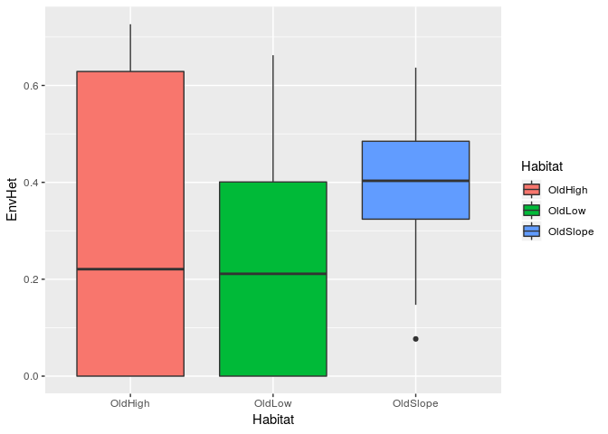

¿Qué patrón percibes? Compara la heterogeneidad ambiental en los bosques viejos sobre vertiente (`OldSlope`) con la de los demás hábitats. ¿Qué diferencias notas?

El histograma es otra herramienta gráfica utilizada en el EDA. Nos informa sobre las características de la distribución (sesgo, varianza, etc.) de la muestra respecto de una variable cuantativa. Te recomiendo que estudies sobre los conceptos y la interpretación del histograma, comenzando si lo deseas por [Wikipedia](https://es.wikipedia.org/wiki/Histograma), pero no olvides utilizar referencias sobre su uso en ecología (Borcard et al., 2018). El siguiente histograma muestra la distribución de dos variables ambientales del conjunto de datos `mite`. El primero muestra la densidad de substrato, el segundo el contenido de agua.

``` r
ggplot(data = mite.env) +
  geom_histogram(mapping = aes(x = SubsDens))
## `stat_bin()` using `bins = 30`. Pick better value with `binwidth`.
```

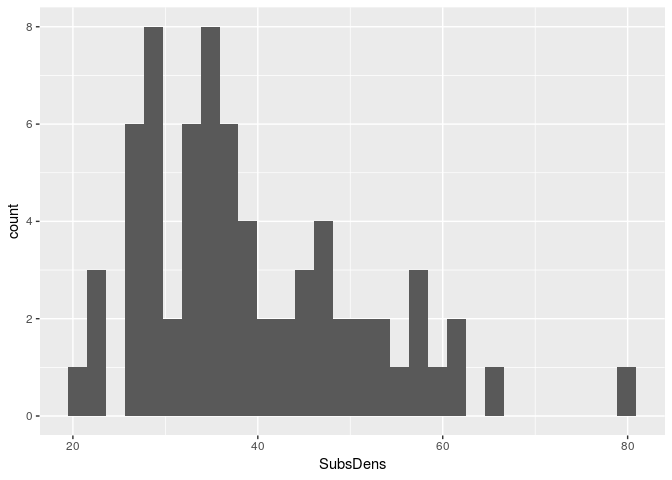

``` r

ggplot(data = mite.env) +
  geom_histogram(mapping = aes(x = WatrCont))
## `stat_bin()` using `bins = 30`. Pick better value with `binwidth`.
```

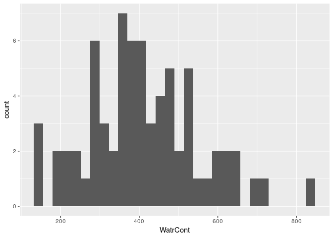

El gráfico es informativo, y de hecho se observan patrones, pero las barras están separadas; mientras más pequeña es la muestra, peor se verá el resultado. Antes de interpretarlo es preferible corregirlo. Para ello, se podría usar el consejo que aparece en la advertencia devuelta por la consola (elegir una anchura de intervalo mejor), aunque por simplicidad es reduciré el número de intervalos. Los gráficos siguientes muestran un mejor resultado:

``` r
ggplot(data = mite.env) +
  geom_histogram(mapping = aes(x = SubsDens), bins = 15)
```

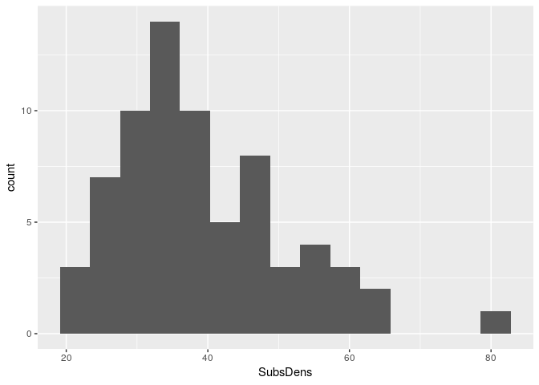

``` r

ggplot(data = mite.env) +
  geom_histogram(mapping = aes(x = WatrCont), bins = 15)
```

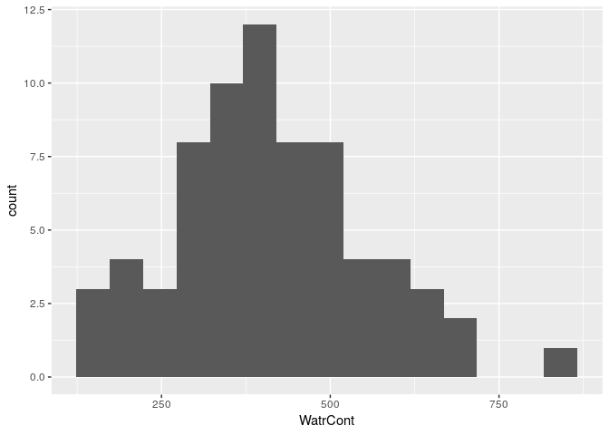

El resultado es más legible ahora. En ambos casos podemos ver que existe un sesgo a la derecha (o positivo), más acentuado en la variable `SubsDens` que en `WatrCont`. Esto significa que la media probablemente está a la derecha del intervalo modal, es decir, los valores extremos "tiran" de ella hacia la derecha, un hecho evidente especialmente en el histograma de la densidad de substrato. Notarás igualmente que el histograma de la variable `WatrCont` se aproxima más a una forma acampanada, mientras que el histograma de `SubsDens` está un poco más alejado de dicha forma. En ecología, la mayoría de los datos no muestran distribución normal, por lo que las técnicas de estadística paramétrica en muchos casos son inútiles (Borcard et al., 2018). El histograma es el primer paso para descubrir este fenómeno, y es sin duda de gran ayuda para elegir apropiadamente las técnicas a utilizar. A modo de referencia, incluyo a continuación un histograma con forma acampanada de una muestra ficticia de 5000 elementos construida a partir de desviaciones aleatorias usando la distribución normal.

``` r
set.seed(500)
alenorm <- data.frame(alenorm = rnorm(5000))
ggplot(data = alenorm) +
  geom_histogram(mapping = aes(x = alenorm), bins = 50)
```

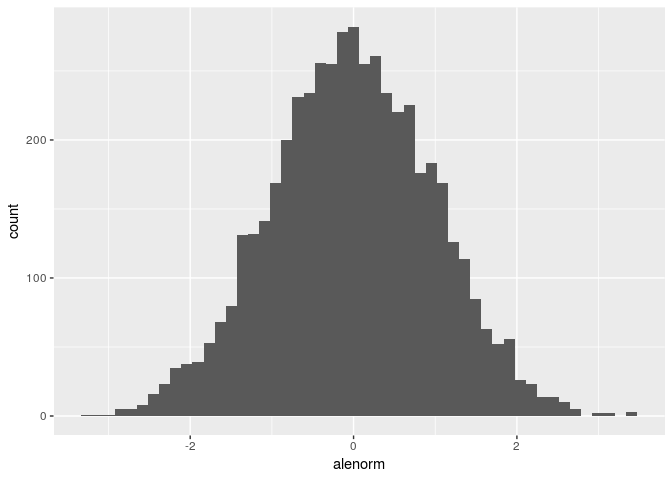

Finalmente, introduzco a continuación los gráficos de facetas o paneles, una herramienta muy potente de `ggplot2`. Para ello, utilizaré el conjunto de datos `mite`. Supón que necesitas mostrar el comportamiento de una variable en un único panel, para tener una idea rápida de tu muestra (también se pueden hacer paneles de muchas variables, previa reorganización de los datos con `tidyr`, pero eso lo veremos más adelante). La función `facet_grid` es tu aliada. Supongamos que necesitamos ver diagramas de dispersión de la densidad de substrato y el contenido de agua para cada uno de los subconjuntos de muestra según densidad de arbustos (recordemos que existen tres tipos de densidades de arbustos: `None<Few<Many`). Esto podría ser útil para evaluar si existe algún grado de asociación diferente entre los distintos subconjuntos. Veamos el gráfico

``` r
ggplot(mite.env) +
  geom_point(aes(x = SubsDens, y = WatrCont)) +
  facet_wrap(~Shrub)
```

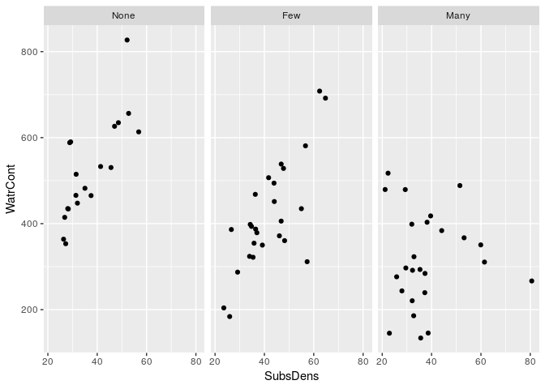

El panel está mostrando que existe correlación entre las variables densidad de substrato y contenido de agua para los subconjuntos de sitios donde hay pocos o nulos arbustos. En los sitios donde hay muchos arbustos, la correlación se difumina ligeramente, porque aparecen valores atípicos que habría que tratar de manera especial.

### BONUS: panel de correlaciones

El paquete `ez`, apoyándose en `ggplot2`, construye gráficos de dispersión, gráficos de densidad e imprime a su vez el valor del coeficiente `r`. Muy útil cuando se quiere explorar muchas variables al mismo tiempo. Fíjate en este útil panel de correlaciones usando el conjunto `doubs`.

``` r
library(ez)
ezCor(
  doubs$env,
  r_size_lims = c(3,6),
  label_size = 5
)
```

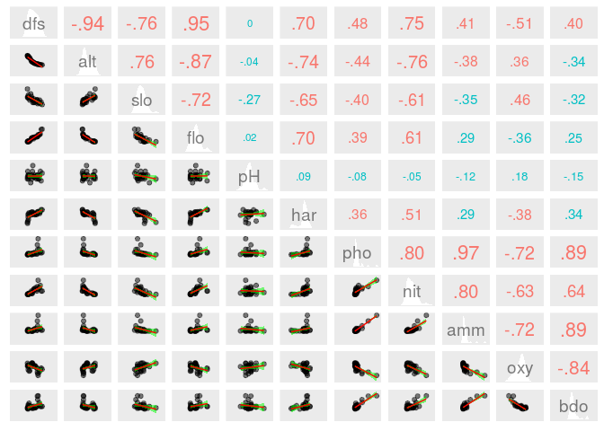

> **Nota**. la función `ezCor` sólo admite `data.frame` de columnas numéricas.

Conclusión
----------

Conociste las herramientas básicas para realizar un EDA ágilmente y generando gráficos informativos. **El EDA es un paso imprescindible en cualquier investigación**, así que, ya que no te lo podrás saltar, es necesario que practiques con los datos de ejemplo mostrados aquí, o con los tuyos propiamente.

Aunque los paquetes de análisis de datos ecológicos no están "saborizados" al estilo `tidyverse`, al menos el EDA lo podrás realizar utilizando tuberías de esta potente colección de paquetes. Conocerás más herramientas de `tidyverse` en el siguiente capítulo de esta novela.

Situaciones comunes
-------------------

-   R es sensible a las mayúsculas. No es lo mismo `Mi_objeto` que `mi_objeto`.
-   *"En RStudio, ¿Qué atajo de teclado es que usan para poner el operador de asignación `<-`?"* Debería funcionarte `ALT+-`, pero recuerda, sólo lo podrás usar en RStudio.
-   *"¿Y el pipe `%>%`?"* `CTRL+SHIFT+M`.
-   Más atajos de teclado de RStudio: `ALT+SHIFT+K`.
-   *"Me quedé trancá' en la consola de R con un signo de `+`. ¿Qué hago pa' salir de eso?"* Suele resolverse presionando la tecla `Escape` (`Esc`). Lee [este texto](https://support.rstudio.com/hc/en-us/community/posts/200792676-stuck-on-).

Referencias
-----------

Borcard, D., & Legendre, P. (1994). Environmental control and spatial structure in ecological communities: An example using oribatid mites (acari, oribatei). *Environmental and Ecological Statistics*, *1*(1), 37–61.

Borcard, D., Gillet, F., & Legendre, P. (2018). *Numerical ecology with r*. Springer.

Borcard, D., Legendre, P., & Drapeau, P. (1992). Partialling out the spatial component of ecological variation. *Ecology*, *73*(3), 1045–1055.

Harms, K. E., Condit, R., Hubbell, S. P., & Foster, R. B. (2001). Habitat associations of trees and shrubs in a 50-ha neotropical forest plot. *Journal of Ecology*, *89*(6), 947–959.

Oksanen, J., Blanchet, F. G., Kindt, R., Legendre, P., Minchin, P. R., O’hara, R., … others. (2013). Package “vegan”. *Community Ecology Package, Version*, *2*(9), 1–295.

Verneaux, J. (1973). *Cours d’eau de franche-comté (massif du jura): Recherches écologiques sur le réseau hydrographique du doubs: Essai de biotypologie* (PhD thesis). Institut des Sciences Naturelles.

Wickham, H. (2016). *Ggplot2: Elegant graphics for data analysis*. Springer.

Wickham, H., & Grolemund, G. (2017). *R for data science: Import, tidy, transform, visualize, and model data* (1st ed.). Retrieved from <http://r4ds.had.co.nz/>
